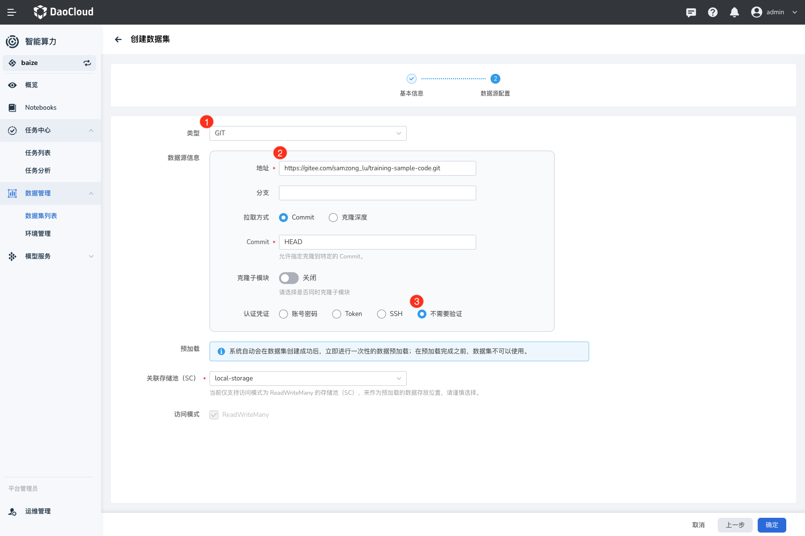
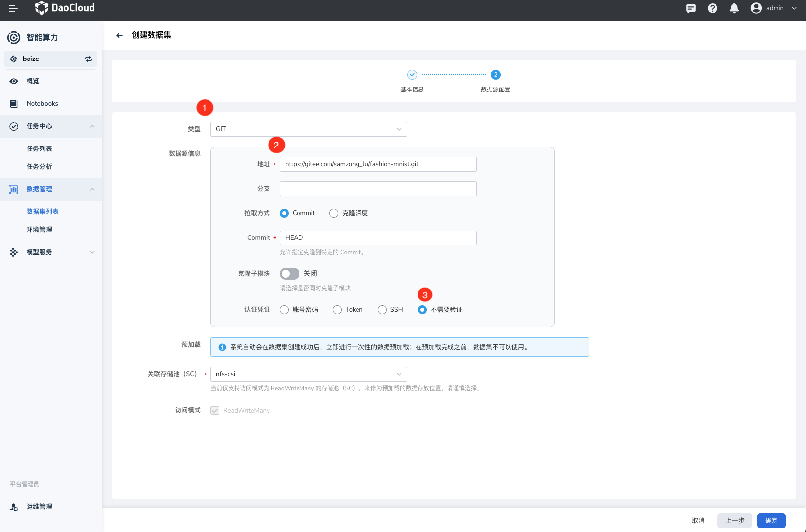
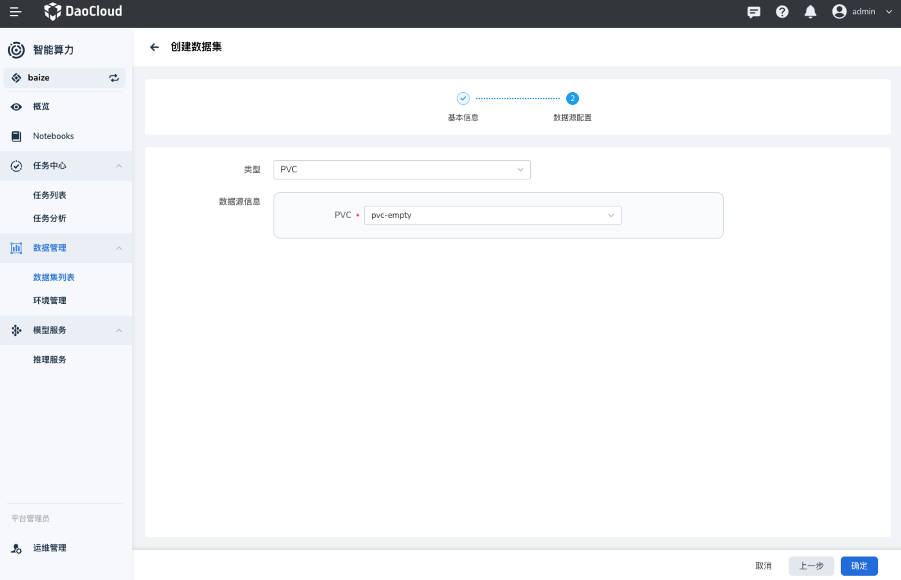
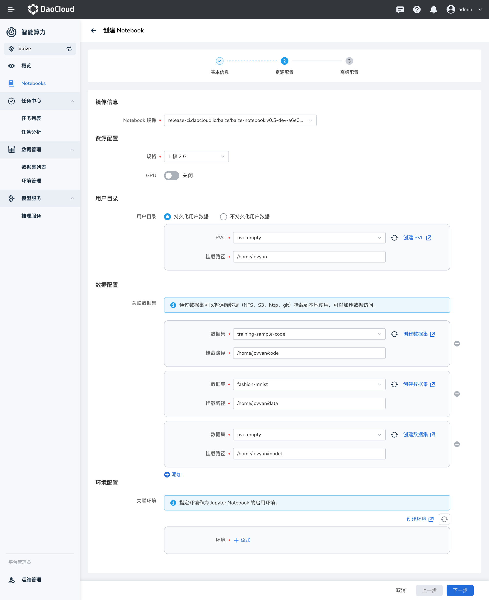
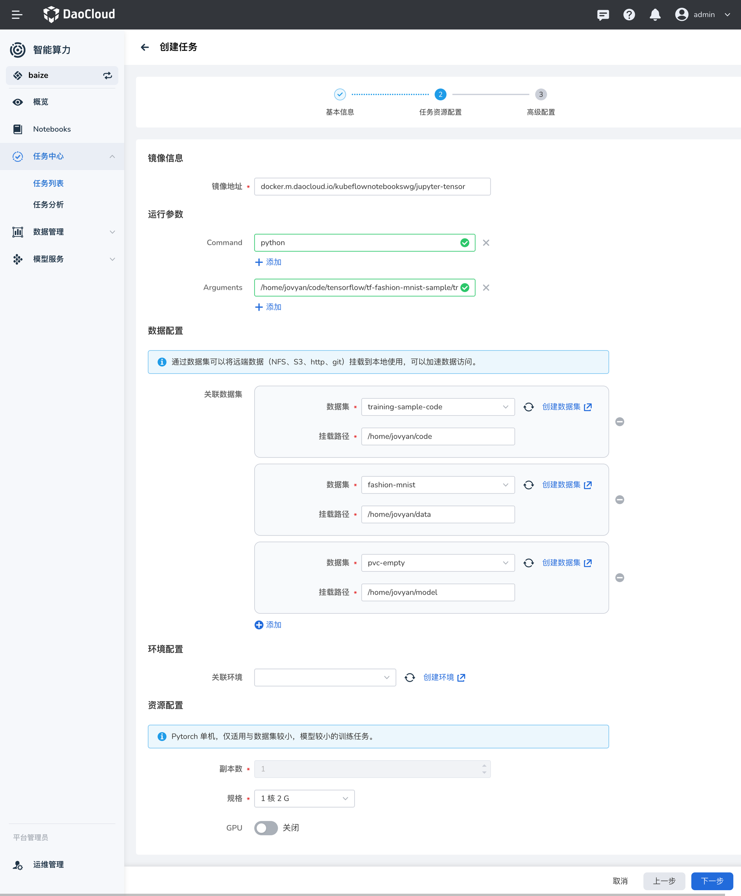
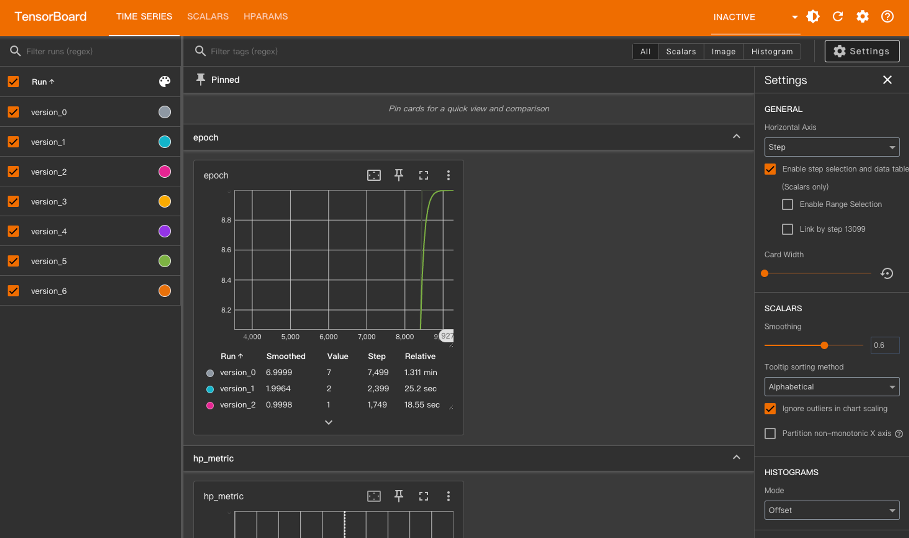

# 快速入门

本文提供了简单的操作手册以便用户使用 d.run 算法开发进行数据集、Notebook、任务训练的整个开发、训练流程。

1. 点击导航栏的 **数据管理** -> **数据集列表** ，点击 **创建** 。创建三个数据集，分别为：
    - 代码： `https://github.com/samzong/training-sample-code`
        - 国内慢可以使用 gitee 加速： `https://gitee.com/samzong_lu/training-sample-code.git`
    - 数据： `https://github.com/zalandoresearch/fashion-mnist`
        - 国内慢可以使用 gitee 加速： `https://gitee.com/samzong_lu/fashion-mnist.git`
    - 空的 PVC：创建一个空的 PVC 以便输出训练结束的模型和日志。

    !!! note

        目前仅支持读写模式为 ReadWriteMany 的 StorageClass，支持使用 NFS 或者推荐使用 [JuiceFS](https://juicefs.com/zh-cn/)。

    

    

    

2. 准备开发环境，点击导航栏的 **Notebooks** ，点击 **创建** 。将上一步中创建的三个数据集进行关联，挂载路径请参照下图填写：

    

3. 等待 Notebook 创建成功，点击列表中的访问地址，进入 Notebook。并在 Notebook 的终端中执行以下命令进行任务训练。

    ```shell
    python /home/jovyan/code/tensorflow/tf-fashion-mnist-sample/train.py
    ```

    

4. 点击导航栏的 **任务中心** -> **任务管理** ，创建一个 Pytorch 单机任务，任务配置参考下图，并在上一步中开启 **任务分析（Tersorflow）** 功能，点击 **创建** 后等待状态完成。

    - 镜像地址填写：[`docker.m.daocloud.io/kubeflownotebookswg/jupyter-tensor`](http://docker.m.daocloud.io/kubeflownotebookswg/jupyter-tensor)
    - Command：python
    - Arguments：`/home/jovyan/code/tensorflow/tf-fashion-mnist-sample/train.py`

    !!! note

        数据集或模型较大时，建议在第二步资源配置中开启 GPU 配置。

    

5. 在上一步创建成功的任务，即可在任务分析中，点击对应任务分析中的访问查看，查看任务状态并对其进行任务训练的调优。

    
