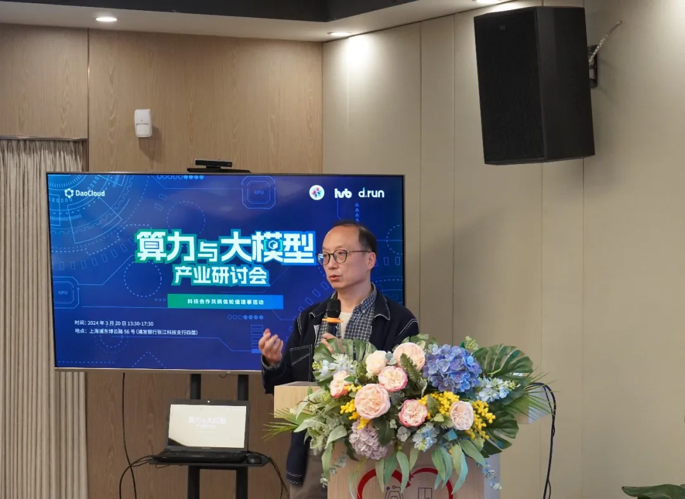
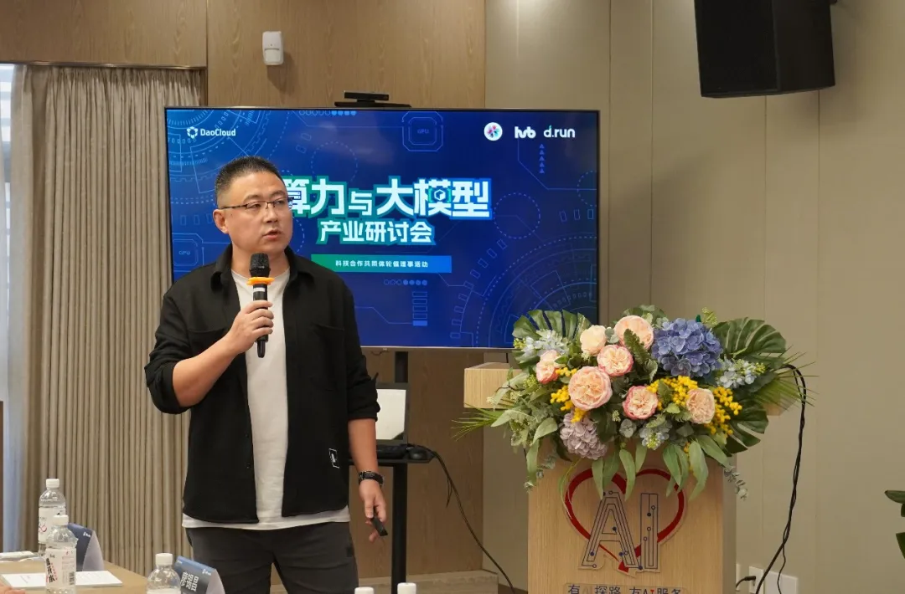
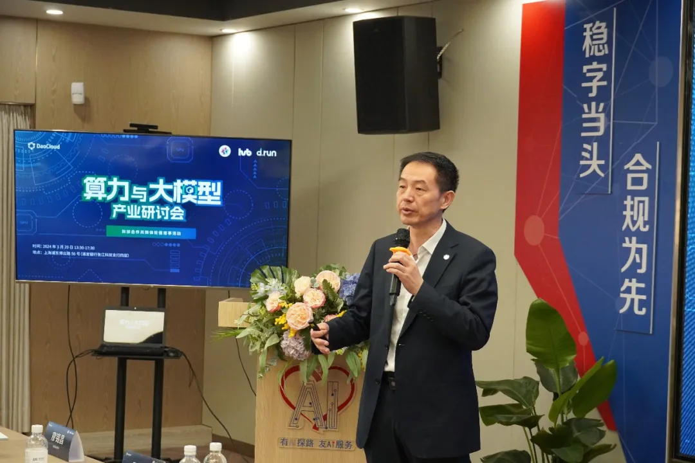

# 金融行业迎来大模型时代，算力基建成决胜关键

为了在金融行业构建自主、安全、稳定、强大的算力基础，「DaoCloud 道客」作为浦发银行科技合作共同体的成员，承办了此次算力与大模型产业研讨会，邀请了金融行业的专家、浦发创新社区成员和大模型行业专家共同交流，探索算力服务的新模式。

作为东道主的浦发银行张江科技支行发表了开场致辞，表达了希望更多地运用科技手段和数据来为客户提供优质服务。

## 破局银行业算力瓶颈

我们在金融行业看到了中国企业未来拥抱大模型和 AI 应用的确定性，找到适合中国企业的大模型发展路径尤为重要。

「DaoCloud 道客」CEO – 陈齐彦分享道： **通用人工智能是一个三角形，其中算力是重要的一部分，但还有两个同样重要的要素，即算法和数据。**

在面对海外算力的优势之下，我们会陷入疯狂焦虑，问自己需要多少算力，我们需要意识到在算力无法成为长处的情况下，需要尽可能在另外两个要素的轴距上争取并扩大我们自己的优势。当你真正涉足这个领域后，会发现在中国市场上要做好这件事非常困难，原因是对整个架构的理解不够完整，甚至会误认为构建算力基础设施就是购买显卡。

然而，实现 AI 应用的落地不仅仅依靠几张 GPU 卡就可以实现， **还需要整个生态体系的支持**。**除了需要 GPU 硬件，还需要重要的算力管理和调度** ，其中包括基于云原生 Kubernetes 的一系列网络、存储等相关技术。当下算力调度的重点是能够将上千上万张 GPU 卡串联起来完成工作的能力。

「DaoCloud 道客」作为在云原生 Kubernetes 上游领域做了近 10 年贡献的企业，将云原生技术应用于结合 AI 算力和大模型中，支持企业更好地完成算力调度工作，并异构纳管海内外不同企业的 GPU 以保障业务的连续性和稳定性。

在面对银行业算力瓶颈时，一方面可以在满足信创的情况下运用云原生技术来承接 AI 的冲击，另一方面也建议金融企业可以考虑将 **金融与算力基建结合** ，共同拓宽算力赛道，这也不失为是一个值得期待的未来方向。

## 浦发的 “热带雨林”

浦发银行上海分行普惠金融部为我们带来了浦发银行自身金融科技之路的发展分享，浦发银行一直致力于打造一个丰富的生态系统“热带雨林”。这个生态系统中，不仅有庞大的乔木（大型上市企业），还有成长中的苗木（拟上市中的企业），以及茂盛的灌木（高成长性企业），它们共享同一片土壤和天空。在热带雨林生态圈中，包括投资人、政府机构、其他服务机构等，还涵盖了产业链上下游。

面对科技金融， **浦发银行秉持共生、共存、互自我更新、自我成长的理念，倡导相互信赖和互助，并共同茁壮成长。**

## 大模型从理论走向实践

南洋商业银行（中国）资讯科技部大模型团队现场分享了大模型在银行业落地的实践经验。当前大模型的投入产出比较低，中小银行在资源投入上往往受限，南商中国选择以知识库为切入点，推进大模型智能助手建设。看似只是简单的问答形式，背后也蕴含着新技术应用和较多的工程化工作。大模型知识库可以按不同员工角色建立不同的问答机器人场景，并减少知识库的运营压力。

在实践过程中，我们面临诸多挑战，包括数据私密性和安全性、知识切片方式、算力调度能力、算法优化效果，以及大型模型的幻觉等问题，这些都会影响到最终的效果。然而，智能化的发展道路是明确的。 **面对新事物的出现，我们常常会高估它的短期影响，而低估它的长期发展。** 在 AI 发展的时代浪潮中，我们深感荣幸能与合作伙伴携手并进，在大模型领域不断探索创新。

## 大模型的生命力

无限光年的联合创始人徐盈辉带来了在大模型训练过程中的一些思考，与金融从业者视角有些不同，徐总表示当下大环境中，模型训练结构本身的创新还是比较少的，更多是关注在模型训练不达预期的情况下，如何进行调整？ **答案的核心是做数据** 。大家觉得 Open AI 强大，并不是因为单一的大模型强，而是整个以数据为中心的高质量数据供给链强大。

因此，我们将模型训练达到 **"model help data"** 的程度，才是大模型时代的未来： **以数据为核心的思考方式** 。

为此，我们需要在分布式集群上，通过深度学习算法，利用小模型在海量的预训练数据中提取出干净有效的数据，让数据变得更有价值。企业需要关注将行业经验规则在系统链路中发挥它应有的价值，让大模型的工作像人一样思考，符合人的思考逻辑和路径。

徐总表示人的认知其实限制了自身的发展。条条大路通罗马，解决方法不唯一，大模型没有所谓最强，如何让这个模型适应不同的人，让每个人都可以到达罗马才是大模型赋予社会更深的意义。 **大模型的生命力源自于对开放问题的适配，帮助企业在已知中探索更多的未知。**

## 行业化和垂直化是大模型未来方向

四川天府银行的科技研发部负责人沈总给大家带来了分享，在天府与「DaoCloud 道客」合作金融业务容器化的基础上，逐步将天府的科技金融能力升级并与北大合作，研发了 CodeShell 代码大模型。天府通过一个顶尖的人工智能团队，搭配完全自主知识产权的大模型，可以深度定制、私有化部署，满足自有金融的业务理解和场景落地，当优质的公开数据被消耗完了之后， **巨大的企业私有数据更值得被深入挖掘** ，基于企业数据安全、银行合规性、提高大模型效率和可持续性等原因， **大模型行业化、垂直化的深度定制一定会成为未来的发展方向之一** 。

目前 CodeShell 大模型直观的优势在于精通金融知识，且对天府银行所有规章制度和产品管理都很了解，也对于现有银行的客户们非常熟悉，这样的专业性大模型对于企业日常的工作提效是非常明显的。天府银行也希望不断在大模型实践中摸索前行，争取在 AI 时代依然站在前沿。

## 银行信创的自主可控

宇信科技与「DaoCloud 道客」在云原生的场景上有较多的业务合作，自身也有 25 年的金融服务经验，针对核心业务整体下移也是有丰富的经验。迁移的应用架构里需要实现 4 个不变：

1. 业务流程不改变
2. 业务功能不改变
3. 业务逻辑不改变
4. 外围接口不能变

保障以上 4 个不变化的时候，业务下移所受到的影响是最小的。但是在这个过程中整体架构是需要变化的，对应的应用架构、数据库架构、以及灾备等业务连续性的架构都有对应调整。同时还有数据迁移的问题，面对持续迭代的金融业务和存量金融产品的处理，都是需要结合经验给出不同的对应方案。

宇信科技信创业务部解决方案总监管汉表示：
**整体架构设计上应用、数据和技术架构需要有对应关系，将复杂的事情拆分成小颗粒，简单化，才能更好的支撑科技金融的业务场景。**

## 圆桌讨论

本次活动的圆桌环节邀请了学术界复旦大学计算机科学技术学院教授、副院长 – 汪卫、金融行业的华泰证券信息技术部平台研发中心负责人 – 王新明、浦发银行信息科技部创新实验室副处长 - 郭林海，还有科技企业的代表蜚语科技 CTO – 杨文博与「DaoCloud 道客」联合创始人兼 CTO – 郭峰一起碰撞交流大模型应用使用的感想。

华泰：目前的大模型在落地过程中有种初见惊艳，再见渐平，细品惋惜的缺憾感，在专业领域中的应用距离我们的预期还是有一些差距。
我们 **定位“大模型“是一个革命者，对现有管理造成冲击是必然的** ，如果可以利用大模型将历史与实时数据进行对比，
在更成熟稳定的阶段下，肯定可以帮助我们做出更准确的判断。 **未来大模型的想象力无限** ，作为金融从业者角度出发，
目前我们能做的是将数据质量提升，更开放的探索可落地的场景， **为科技金融寻找一个最优解** 。

复旦：高校在现实中碰到的问题与大家都很相似。融合在大模型的时代形成人才培养的体系是目前大家遇到的共同问题，
**在大模型时代人才的能力需求和培养模式将和以前存在很大的差别** 。大模型精确性不够，存在各种幻觉等问题，
虽然有通过调整模型和知识优化来优化，但发现真正需要的其实是一个系统性的解决方案，而不仅仅是单点问题的补丁。

蜚语：作为一家专注软件开发和代码安全的企业，我们的视角更关注大模型对于代码的应用，它可以做一些基础的修复和撰写，但目前基于输入的窗口是非常有限，而实际项目的代码行几万甚至几百万，很难直接通过大模型直接输出或者归纳整理。同时，当下大家对于大模型替代人的工作都有一些恐慌，但是当你学会尝试掌握大模型的时候，其实对应了现在大家很流行的一句话：
**质疑它、理解它，成为它。我们与 AI 关系也会是互相成就。**

最后，通过本次大会，「DaoCloud 道客」希望能够更多元、开放的与算力生态圈的同僚们共同搭建一个跨界交流的平台，与各界专家一起深入讨论算力和大模型相关的技术，商业模式和投资机会，相信大家对于 AI 算力大模型的思考远不止这些，如果有更多想法想与我们沟通探讨。欢迎大家来报名参加 3 月 28 日 2024 DaoCloud 算力品牌发布会。

[注册并体验 d.run](https://console.d.run/){ .md-button .md-button--primary }
