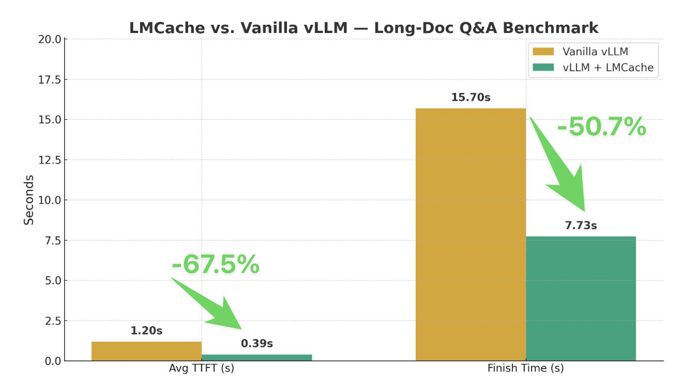

# LMCache 上线即支持 GPT-OSS（20B/120B）

> 英文原稿：[LMCache 博客网站](https://blog.lmcache.ai/2025-08-05-gpt-oss-support/)

LMCache 是一种大型语言模型（LLM）推理引擎扩展，用于减少 TTFT（首个 Token 延迟）并提升吞吐量，尤其适用于长上下文场景。
它通过将可复用文本的 KV 缓存存储在多个位置（包括 GPU、CPU 内存、本地磁盘）中，实现跨任意推理引擎实例复用这些缓存（不仅限于前缀文本）。
因此，LMCache 能够节省宝贵的 GPU 计算资源，并减少用户响应延迟。

将 LMCache 与 vLLM 结合使用，在多轮问答（QA）和 RAG 等多种 LLM 场景中，开发者可实现延迟和 GPU 计算量的 3~10 倍优化。

LMCache 上线就支持 OpenAI 新发布的 GPT-OSS 模型（20B 和 120B 参数）！本文将提供为 GPT-OSS
模型配置 vLLM 与 LMCache 的完整步骤，并通过 CPU 缓存卸载功能展示显著的性能提升。



## 第一步：安装 vLLM GPT OSS 版本

### 安装

```shell
uv pip install --pre vllm==0.10.1+gptoss \
    --extra-index-url https://wheels.vllm.ai/gpt-oss/ \
    --extra-index-url https://download.pytorch.org/whl/nightly/cu128 \
    --index-strategy unsafe-best-match
```

### 测试安装

```shell
vllm serve openai/gpt-oss-120b \
  --max-model-len 32768 \
  --disable-hybrid-kv-cache-manager
```

```shell
curl http://localhost:9000/v1/chat/completions \
  -H "Content-Type: application/json" \
  -d '{
    "model": "openai/gpt-oss-120b",
    "messages": [
      {
        "role": "user",
        "content": "Hello how are you today"
      }
    ],
    "temperature": 0.7
  }'
```

## 第二步：从源码安装 LMCache

### 为什么要从源码安装？

vLLM 需要使用 PyTorch 的 nightly 版本来运行 GPT 模型。为了确保兼容性，我们强烈建议基于当前虚拟环境中的 PyTorch 版本安装 LMCache。

### 安装步骤

从源码安装 LMCache（该命令可能需要几分钟时间，因为会编译 CUDA 内核）：

```shell
git clone https://github.com/LMCache/LMCache.git
cd LMCache

# 在你的虚拟环境中
ENABLE_CXX11_ABI=1 uv pip install -e . --no-build-isolation
```

### 测试安装

```shell
python3 -c "import torch; import lmcache; import lmcache.c_ops"
```

## 第三步：运行 vLLM 与 LMCache

### LMCache 配置

创建一个 backend\_cpu.yaml 配置文件用于 CPU 缓存卸载：

```yaml
# 创建一个 80G 的 CPU 缓存区
chunk_size: 256
local_cpu: True
max_local_cpu_size: 80
```

### 启动 vLLM 与 LMCache

```shell
LMCACHE_CONFIG_FILE="./backend_cpu.yaml" \
LMCACHE_USE_EXPERIMENTAL=True \
vllm serve \
    openai/gpt-oss-120b \
    --max-model-len 32768 \
    --disable-log-requests \
    --disable-hybrid-kv-cache-manager \
    --kv-transfer-config \
    '{"kv_connector":"LMCacheConnectorV1", "kv_role":"kv_both"}'
```

## 第四步：性能基准测试结果

### 使用场景：长文档问答

* 输入：20 个不同的文档，每个文档平均长度 2 万个 token
* 输出：每个查询 50 个 token

1. 阶段 1：将所有文档发送到推理引擎，预热 KV 缓存
2. 阶段 2：打乱查询顺序再次发送，并测量 TTFT 和完成时间

### 性能结果

阶段 2 的基准测试结果显示性能有显著提升：

| 配置             | 平均 TTFT（秒） | 完成所有查询时间（秒） |
| -------------- | ---------- | ----------- |
| 原生 vLLM        | 1.20       | 15.70       |
| vLLM + LMCache | 0.39       | 7.73        |

### 为什么性能提升显著？

在使用单张 A100/H100 运行 GPT-120B 时，可用的 KV 缓存 GPU 缓冲区通常小于 10GB。
通过 LMCache 的 CPU 缓存卸载功能，vLLM 能存储和复用更多前缀的 KV 缓存，从而实现：

* **TTFT 减少 67%**
* **总查询完成时间减少 51%**

### 运行基准测试

你可以使用我们的基准测试脚本复现这些结果：

```shell
python long-doc-qa.py --num-documents 20 \
  --document-length 20000 --output-len 50 \
  --repeat-count 1 --repeat-mode random \
  --shuffle-seed 0
```

## 参考资料

* [lmcache.ai 官网](https://lmcache.ai/)
* [LMCache 仓库](https://github.com/LMCache/LMCache)
* 查看[完整基准测试脚本](https://github.com/LMCache/LMCache/blob/dev/benchmarks/long-doc-qa/long-doc-qa.py)。
