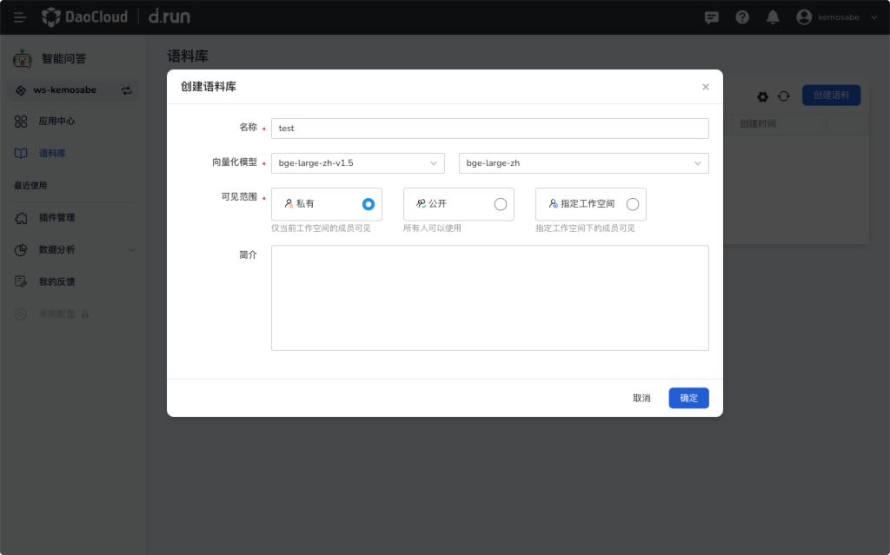
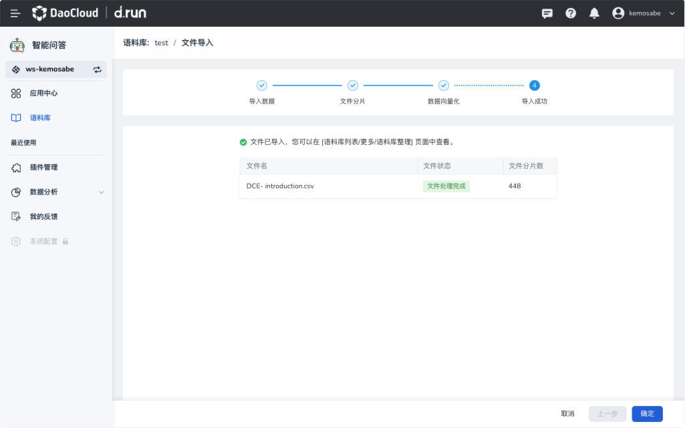
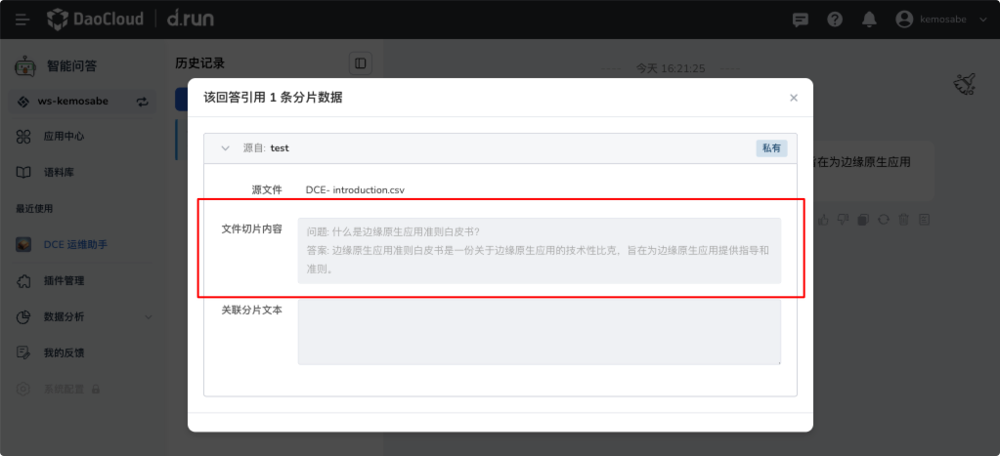
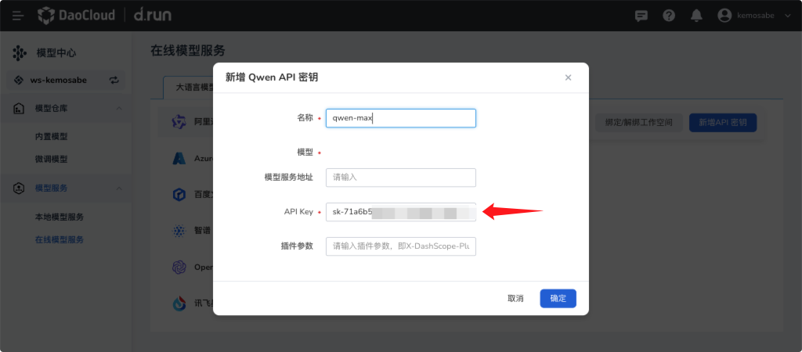
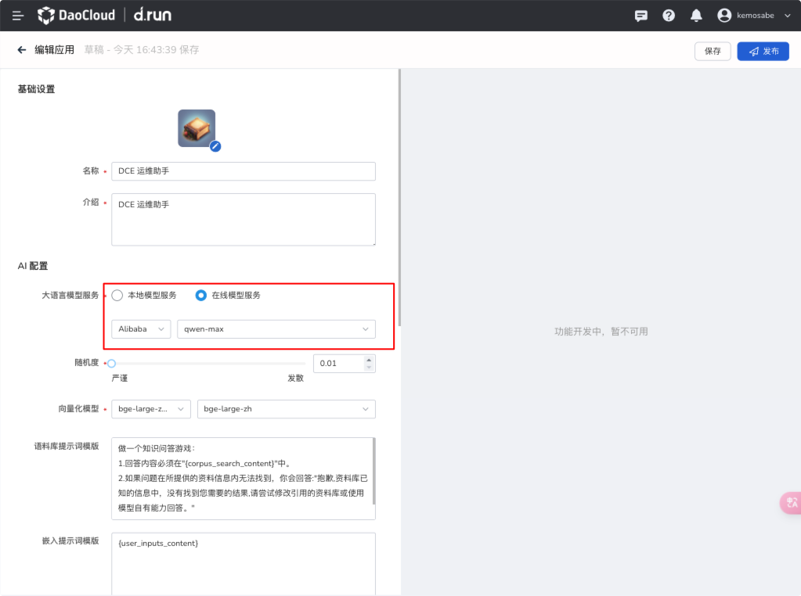

# Quick Start

## 注册账号

注册之后，系统会发送一封邮件，点击邮件中的链接激活账号。

激活后系统自动分配以下资源：

1. 一个默认的工作空间
2. 一个向量化模型服务：bge-large-zh
3. 一个模型服务：chatglm3-6b
4. 一个队列，用于运行模型训练

下面我们会使用这些资源，来体验一些功能。

## 免费体验

### 场景 1: 使用本地模型服务，创建一个 RAG 应用

1. 点击左上角打开主菜单，然后点击**模型中心**

    

    确认已经分配了大语言模型服务`chatglm3-6b`和向量化模型服务`bge-large-zh`

    

    

2. 整理语料

    我们整理一个 CSV 文件，第一列是 Question，第二列是 Answer，例如：

    ```csv
    #,问题,答案
    1,什么是边缘原生应用准则白皮书？,边缘原生应用准则白皮书是物联网边缘工作组（IOT Edge Working Group）发布的一个文件，探索边缘原生的定义，以及“云原生”和“边缘原生”之间的异同。
    2,DCE 5.0 社区版包含哪些开源项目？,"DCE 社区版包含的开源软件有：\n\ncloudtty：Kubernetes 网页版控制台，易于使用\nClusterpedia：Kubernetes 多集群资源百科全书，已入选 CNCF 沙箱孵化，中国移动等已部署至生产\nFerry：Kubernetes 多集群通信组件，消除多集群复杂度\nHwameiStor：高可用的本地存储方案，更快、更强、更可靠，已入选 CNCF 全景图，正在申请 Sandbox\nKLTS：对 k8s（最新版本 - 0.03）等 10 多个版本的持续维护\nKubean：容器化集群的全生命周期管理工具，正在申请 Landscape\nKWOK：模拟成千上万的 kubelet\nMerbridge：使用 eBPF 加速服务网格，已入选 CNCF 全景图和 Sandbox\nSpiderpool：云原生网络 IPAM 自动化管理软件，建议作为插件用于 Underlay CNI，正在申请 Landscape 和 Sandbox\n公开镜像加速：加速国外镜像的下载\n以上只是 ""DaoCloud 道客"" 技术的冰山一角，还有更多项目。"
    3,KWOK 是什么？,KWOK 是 Kubernetes WithOut Kubelet 的缩写，帮助用户在几秒钟内搭建一个由数千个节点构成的集群，用少量资源模拟几千个真实的节点。
    4,Karmada 是用于什么场景的项目？,Karmada 是用于多云和混合云场景中的项目，可以实现应用跨数据中心、跨可用区和跨集群高可用。
    ```

    可以在这里下载：[DCE-introduction.csv](./DCE-introduction.csv)

3. 创建语料库

    1. 点击左上角打开主菜单，点击**智能问答**
    2. 点击**语料库**，然后点击**新建语料库**
    3. 输入语料库名称，例如`test`
    4. 选择向量化模型和向量化模型服务
    5. 点击**确定**

        
       
    6. 点击语料库名称，进入语料库详情
    7. 点击**文件导入**

        
       
    8. 选择刚才整理的 CSV 文件，然后一直点击**下一步**，直到最后一步导入成功后，点击**确定**。

        

    9. 创建成功后，在语料库详情页，输入一个问题进行搜索，例如`什么是边缘原生应用准则白皮书？`，**按回车键搜索**，可以看到搜索结果和对应的相似度。这里是`0.1828`。

        

4. 创建应用

    1. 点击**应用中心**, 然后点击**立即创建应用**
    2. 选择本地模型服务`chatglm3-6b`
    3. 选择向量化模型服务`bge-large-zh`
    4. 根据应用场景修改提示词
    5. 关联刚刚创建的语料库`test`
    6. 修改相似度到`0.2`

        
       
        
      
    7. 点击右上角**保存**、**发布**

5. 对话

    1. 回到应用中心，点击**对话**的图标

        
       
    2. 在输入框输入`什么是边缘原生应用准则白皮书？`，按回车键，`DCE 运维助手`开始回答我们的问题

        
       
    3. 可以看到引用了我们语料库中的一些数据，这样我们就可以快速构建一个问答系统了。

        

### 场景 2: 使用在线模型服务，创建一个 RAG 应用

[场景 1](#1-rag) 使用的是平台部署的本地模型，这里我们使用在线模型服务。
我们需要去`模型中心`，配置在线模型服务的 API Secret，然后在应用中使用这个服务即可。

1. 切回到`模型中心`，添加在线模型服务
   
    
   
1. 我们可以去[阿里模型广场](https://bailian.console.aliyun.com/?spm=5176.28326591.0.0.40f76ee1iAOVmY#/model-market)，申请 API Key。
   配置我们的 API Key。

    
   
1. 使用刚刚创建的应用`DCE 运维助手`，先下架应用，然后编辑：更改大语言模型 => `在线模型服务`，选择我们刚刚添加的在线模型服务，保存并发布。

    
   
1. 对话

    
   
1. 可以看到，我们的应用已经切换到了在线模型服务，可以继续使用。

### 场景 3：使用流程引擎，自定义流程，创建更灵活的应用

如果觉得使用`智能问答`创建的应用，无法解决我们的问题，我们可以使用`流程引擎`，通过工具自定义构建流程，创建更灵活的应用。
下面我们创建一个应用，来处理`文案合规`的场景。

1. 准备一篇营销文章，包含`绝对`、`万能`，[营销文章Demo](./营销文章Demo.txt)
1. 创建文本数据

    
   
1. 进入`需要验证的营销文章`，点击`导入数据`、`导入文档`

    
   
1. 上传我们的营销文章，点击**上传**，**提交**

    
   
1. 构建流程。
   我们使用以下工具：
  
    - 循环
    - 文本向量搜索
    - 大语言模型多轮对话

1. 测试流程

## 一元体验

### 算法开发

在线Notebook、分布式模型训练

### 模型中心

体验部署本地模型、接入 HuggingFace 模型

### 模型微调

一站式模型微调
