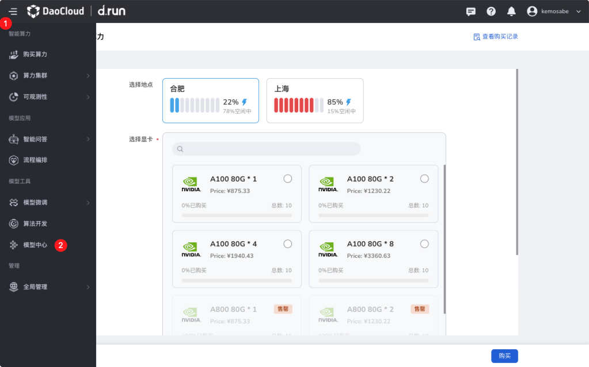
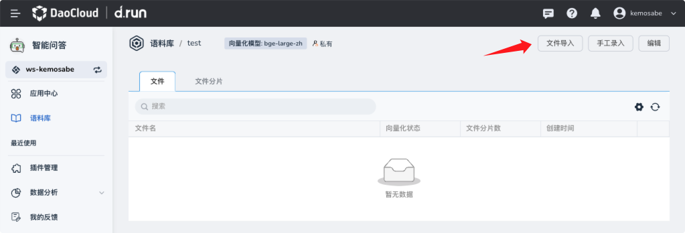
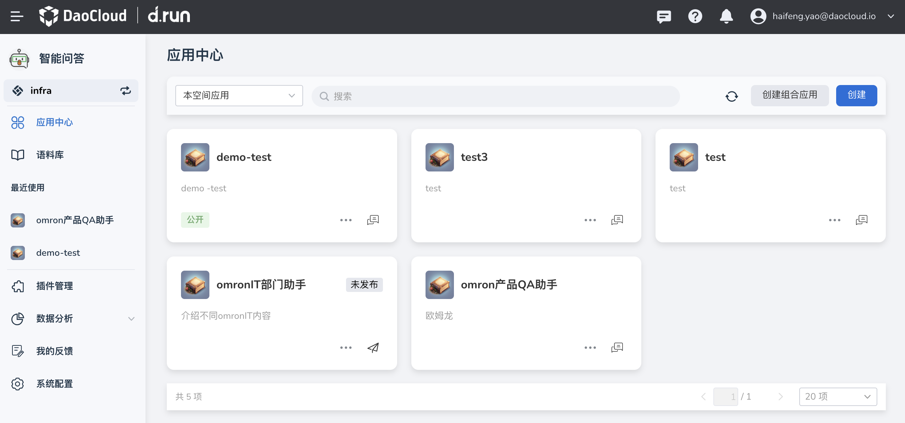
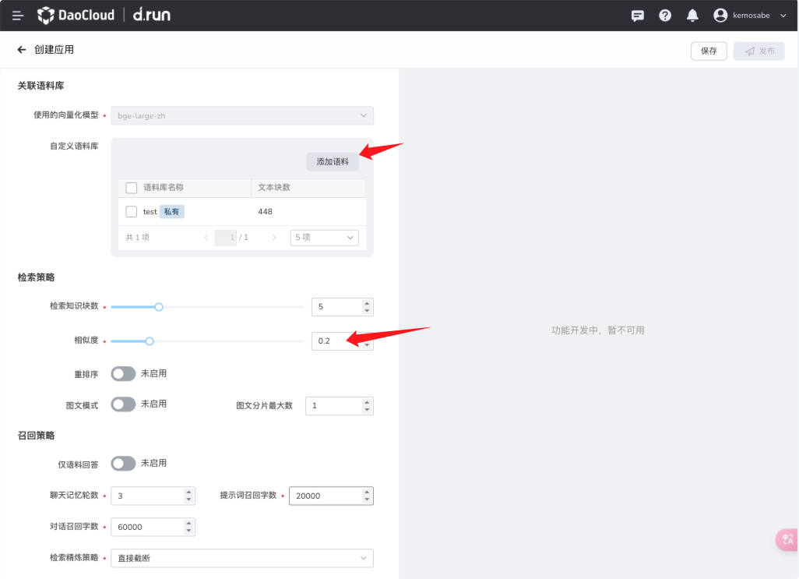
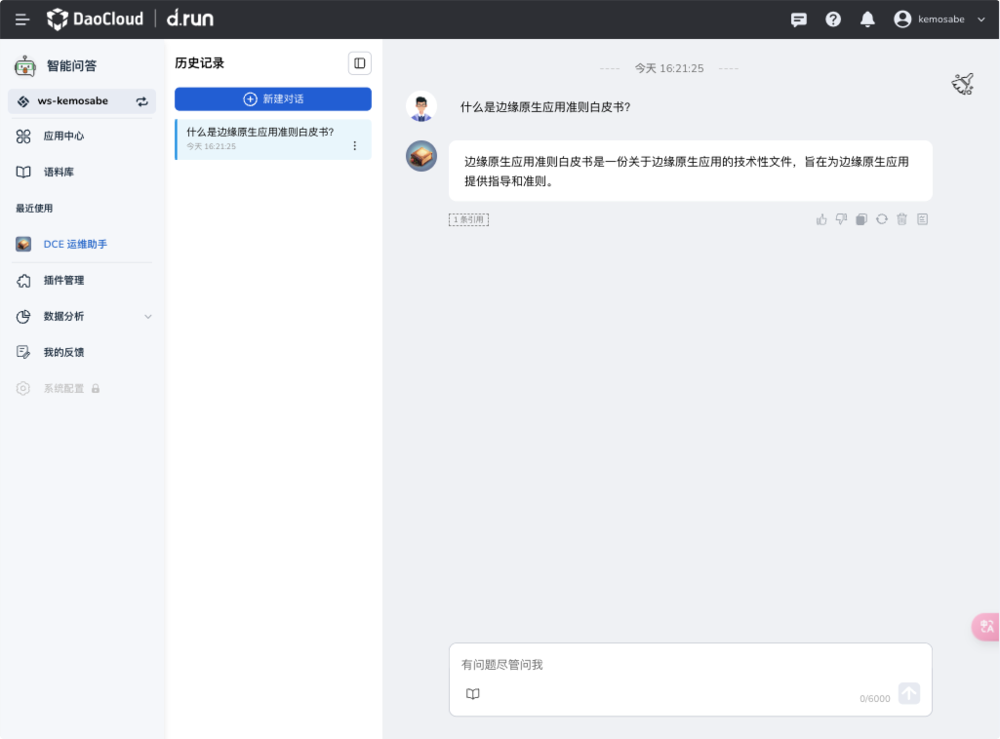
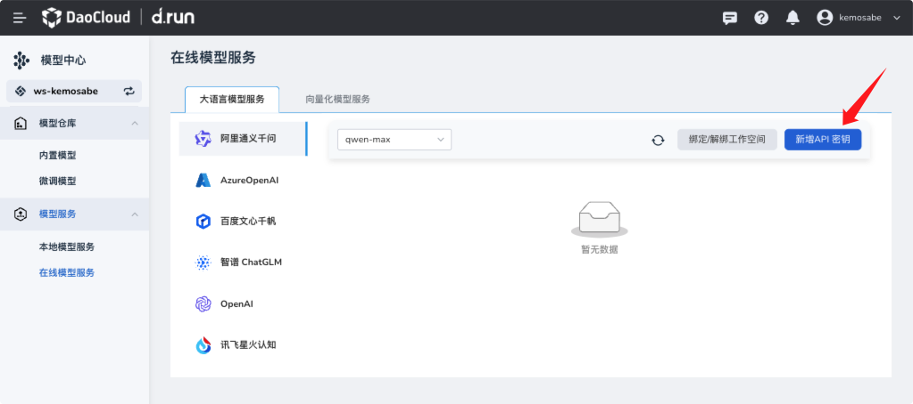
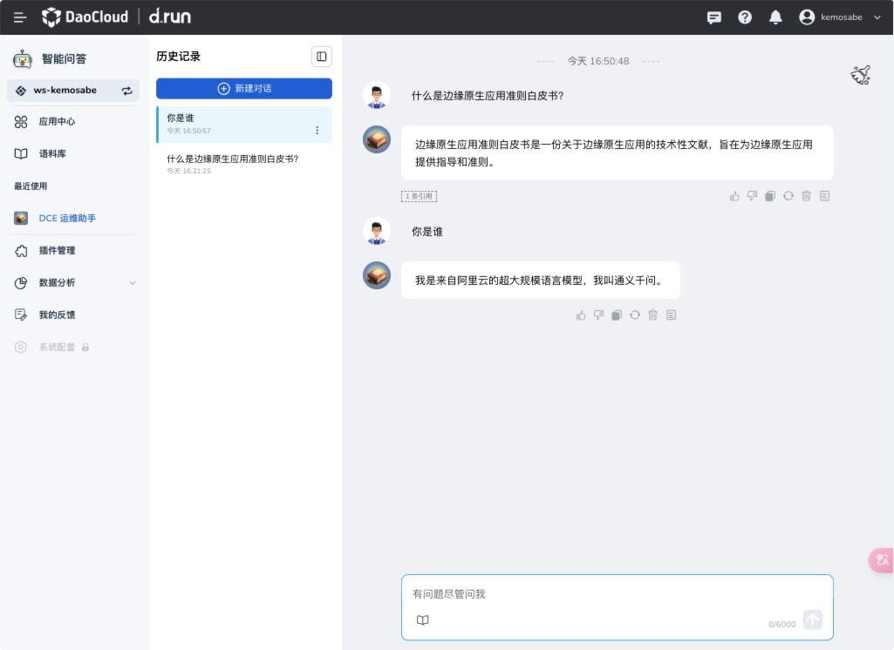
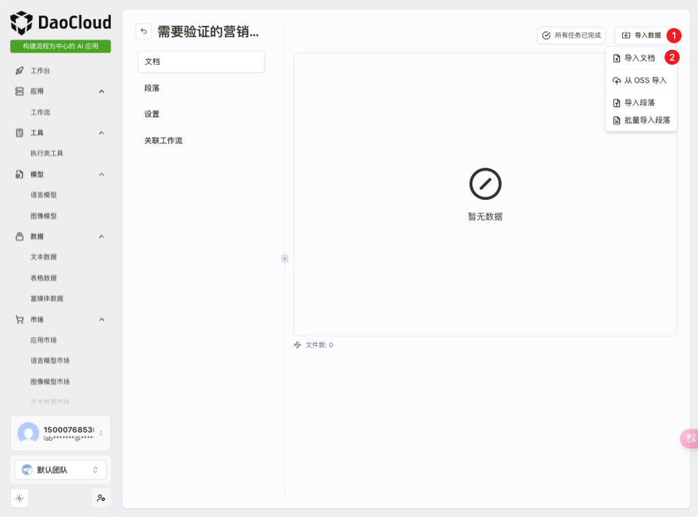
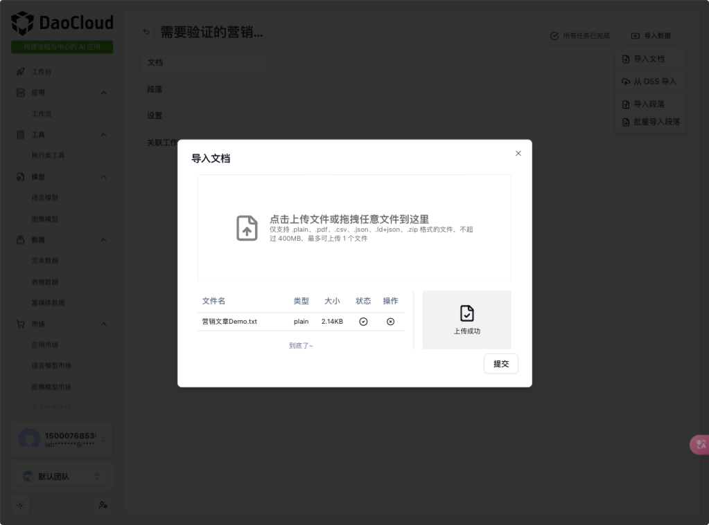

---
hide:
  - toc
---

# 快速入门

本页演示注册 d.run 账号后，如何免费体验、用一元体验 d.run 部分功能。

## 注册账号

您通过邮箱注册账号之后，d.run 系统会发送一封邮件，请点击邮件中的链接激活账号。
更多细节，请参阅以下演示视频。

<div class="responsive-video-container">
<video controls src="https://harbor-test2.cn-sh2.ufileos.com/drun/d.run-workflow.mp4" preload="metadata" poster="./images/workflow.png"></video>
</div>

您在成功激活账号后，d.run 系统会为您自动分配以下资源：

1. 一个默认的工作空间
2. 一个向量化的模型服务：bge-large-zh
3. 一个默认的大模型：chatglm3-6b
4. 一个模型训练队列

## 免费体验

您可以通过使用上述几个自动分配的资源来免费体验 d.run 的部分功能：

- [场景 1：使用本地模型服务创建 RAG 应用](#rag)
- [场景 2：使用在线模型服务创建 RAG 应用](#rag_1)
- [场景 3：使用流程引擎创建更灵活的应用](#_4)

### 使用本地模型创建 RAG 应用

!!! tip

    RAG（Retrieval Augmented Generation，检索增强生成）指的是通过检索获取相关的知识并将其融入提示词，让大模型能够参考相应的知识从而给出合理的回答。

d.run 在免费模式下就可以通过图形界面，使用本地模型来创建一个 RAG 聊天应用：

1. 打开左侧导航栏，进入 **模型中心**

    

    d.run 默认分配了 2 个模型：

    - [chatglm3-6b](https://huggingface.co/THUDM/chatglm3-6b) 是一个可以部署到消费级显卡上的本地模型，支持中英双语对话，基于通用语言模型 (GLM) 架构，具有 62 亿参数，最低只需 6GB 显存。
    - [bge-large-zh](https://huggingface.co/BAAI/bge-large-zh) 是一个向量化模型，能够将文本转换为向量，适合推理和微调。

    

    

2. 准备语料

    语料是模型训练的基础，我们先准备一个 CSV 文件。第一列是问题，第二列是答案：

    ```csv
    #,问题,答案
    1,什么是边缘原生应用准则白皮书？,边缘原生应用准则白皮书是物联网边缘工作组（IOT Edge Working Group）发布的一个文件，探索边缘原生的定义，以及“云原生”和“边缘原生”之间的异同。
    2,DCE 5.0 社区版包含哪些开源项目？,"DCE 社区版包含的开源软件有：\n\ncloudtty：Kubernetes 网页版控制台，易于使用\nClusterpedia：Kubernetes 多集群资源百科全书，已入选 CNCF 沙箱孵化，中国移动等已部署至生产\nFerry：Kubernetes 多集群通信组件，消除多集群复杂度\nHwameiStor：高可用的本地存储方案，更快、更强、更可靠，已入选 CNCF 全景图，正在申请 Sandbox\nKLTS：对 k8s（最新版本 - 0.03）等 10 多个版本的持续维护\nKubean：容器化集群的全生命周期管理工具，正在申请 Landscape\nKWOK：模拟成千上万的 kubelet\nMerbridge：使用 eBPF 加速服务网格，已入选 CNCF 全景图和 Sandbox\nSpiderpool：云原生网络 IPAM 自动化管理软件，建议作为插件用于 Underlay CNI，正在申请 Landscape 和 Sandbox\n公开镜像加速：加速国外镜像的下载\n以上只是 ""DaoCloud 道客"" 技术的冰山一角，还有更多项目。"
    3,KWOK 是什么？,KWOK 是 Kubernetes WithOut Kubelet 的缩写，帮助用户在几秒钟内搭建一个由数千个节点构成的集群，用少量资源模拟几千个真实的节点。
    4,Karmada 是用于什么场景的项目？,Karmada 是用于多云和混合云场景中的项目，可以实现应用跨数据中心、跨可用区和跨集群高可用。
    ```

    !!! tip
    
        点击 [DCE-introduction.csv](images/DCE-introduction.csv) 可下载这个 CSV 文件。

3. 创建和导入语料库

    1. 打开左侧导航栏，点击 **智能问答** -> **语料库** -> **创建语料库** ，填写各项参数后，点击 **确定**

        

    1. 返回语料库列表，点击刚创建的语料库名称，进入语料库详情页，点击右上角的 **文件导入**

        
       
    1. 选择准备好的 CSV 文件，按照向导页面，导入语料文件。

        

    1. 返回语料库列表，点击语料名称进入详情页，选择 **文件切片** 页签，输入一个问题进行搜索，例如`什么是边缘原生应用准则白皮书？`，可以看到搜索结果和对应的相似度。

        

4. 创建聊天应用

    1. 从左侧导航栏，进入 **应用中心** ，点击右侧的 **创建** 按钮

        

    1. 配置好表单的各项参数后，点击右上角的 **保存** 、 **发布** 按钮
    
        - 例如我们将此应用命名为 **DCE 运维助手**
        - 选择本地模型服务 `chatglm3-6b`，选择向量化模型服务 `bge-large-zh`，
        - 根据应用场景修改提示词，关联创建的语料库，修改相似度为 `0.2`

        
       
        

5. 开始对话

    1. 在应用中心，点击应用卡片右下角的 **对话** 图标

        
       
    2. 在输入框中输入问题，按下回车键，就会根据刚导入的语料库给出答案

        
       
    3. 如果你是管理员，在每条回答下方，还可以看到 `xxx 条引用`的提示。
       点击该文字提示，可以看到引用了语料库中的哪些数据。
       如果发现引用的数据有问题，可以在 **语料库** -> **语料库详情** -> **文件切片** 中找到并修改对应的语料。

        

自此，这个名为 **DCE 运维助手** 的 RAG 聊天应用已被成功创建。

### 使用在线模型创建 RAG 应用

除了[场景 1](#rag) 所述的本地模型外，d.run 默认还提供了在线模型服务。

1. 从左侧导航栏进入 **模型中心** ，依次选择 **模型服务** -> **在线模型服务** -> **新增 API 密钥** 按钮
   
    

1. 填写表单

    其中 API Key 可以去大模型官网去申请，例如 [OpenAI API Key](https://platform.openai.com/account/api-keys)、[阿里模型广场](https://bailian.console.aliyun.com/?spm=5176.28326591.0.0.40f76ee1iAOVmY#/model-market) 等等

    

1. 返回 **智能问答** -> **应用中心** ，找到刚创建的 **DCE 运维助手** ，点击卡片下方的 **...** -> **下架** -> **编辑**，
   更改为 **在线模型服务** 。选择上一步通过 API Key 添加的在线模型服务，确认无误后点击右上角的 **保存** -> **发布** 。

    

1. 开始对话，做一些简单的提问。可以看到，已切换到了在线模型服务：通义千问。

    

1. 以此类推，你可以通过 API Key，添加试用主流的各种在线大模型。

### 使用流程引擎创建更灵活的应用

!!! tip

    本节还在建设中，将陆续补充完善。

如果您觉得使用 **智能问答** 创建的应用，还无法解决实际问题，可以使用 **流程引擎** ，通过工具自定义构建流程，创建更灵活的应用。

下面我们创建一个应用，来处理`文案合规`的场景。

1. 准备一篇营销文章，包含`绝对`、`万能`等词条，点击查阅[营销文章 Demo 文本文件](images/marketing-demo.txt)。
1. 从左侧导航栏进入 **流程编排** ，创建文本数据

    
   
1. 进入`需要验证的营销文章`，点击 **导入数据** -> **导入文档**

    
   
1. 上传准备好的营销文章，点击 **上传** -> **提交**

    

1. 使用以下工具构建流程：
  
    - 循环
    - 文本向量搜索
    - 大语言模型多轮对话

1. 测试流程

## 一元体验

本节介绍以 1 元购买算力后可以体验的功能。

!!! tip

    本节还在建设中，将陆续补充完善。

### 算法开发

在线 Notebook、分布式模型训练

### 模型中心

体验部署本地模型，接入 HuggingFace 模型

### 模型微调

一站式模型微调
