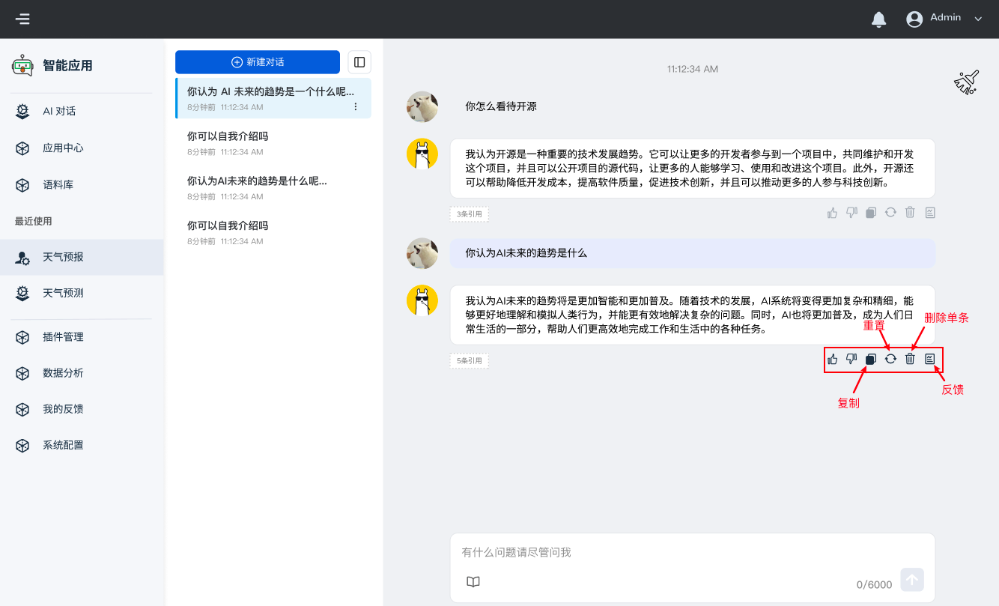

# 如何进行对话

1. 在 AI 对话页面，点击 **新建对话** 选择已发布的应用

2. 在对话框中输入问题，点击 **发送** ，或敲击回车键，进行对话。对话框的输入字符限制为 6000 个字符

## 对话管理

1. 在对话列表中点击具体对话右侧的省略号来进一步对已有的对话进行管理。如下图所示，有 **置顶** 、 **重命名** 以及 **删除** 三个选项。

    - 点击 **置顶** 将当前对话置于整个对话列表的最顶端

    - 点击 **重命名** 对当前对话的标题进行命名

    - 点击 **删除** 删除当前对话

2. 在对话页面，点击左上角的 🧹 图标可以 **清空** 对话。

3. 点击输入框左下角的 📖 可以进行关联语料库

    - 语料库的选择： **聊天应用** 会在选中的语料库中去匹配最相似的语料作为参考，回答用户的问题。显示操作成功表示已经选中语料库。也可以取消选中某个或某些语料库。

    - 注意：与语料库关联的语料库无法选择和更改，只能选择添加我的语料库，中文的应用只可以选择中文语料库，应用为英文只能选择英文语料库

    

## 对话页面功能

1. 评价功能：用户可以对聊天助手的回答进行点赞或点踩，取决于用户对回答内容是否满意。

2. 复制功能：用户可以对聊天助手所回答的内容进行复制。

3. Regenerate 功能：用户可以对聊天助手的回答选择重新生成。

    - 对于重新生成的内容可以通过管理员调节模型的随机度来控制聊天助手多次回答的一致性。

    - 例：选择随机度高的情况下，聊天助手多次回答的结果，可能会有不一样的答案。如果要求回答的准确度高的情况下，可以将随机度设置降低，这样聊天助手每次生成的结果会接近一致。

4. 删除单条聊天功能：用户可以点击聊天助手回答下的垃圾桶按钮进行删除，删除后将清空单条对话，再进行聊天助手上下文对话时将不会对删除的对话有记忆。

5. 反馈功能：用户点击聊天助手回答下气泡按钮进行提交反馈操作，根据聊天助手的回答结果好坏，在反馈中提出反馈意见。

6. 停止对话功能：用户可以在模型回答过程中选择停止对话，让助手停止输出内容。

