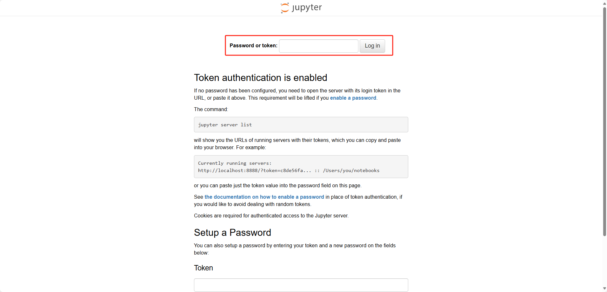
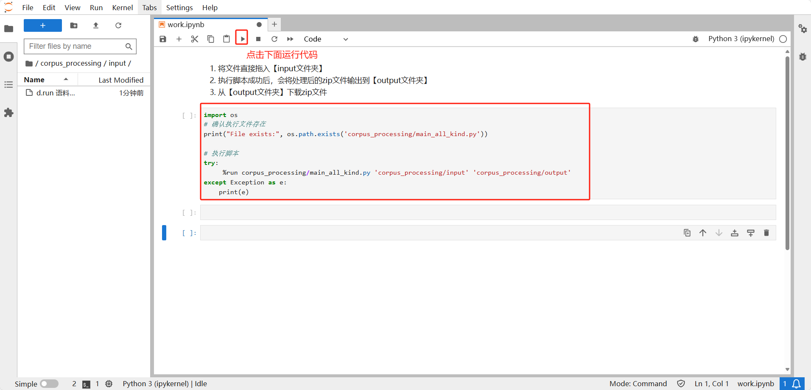
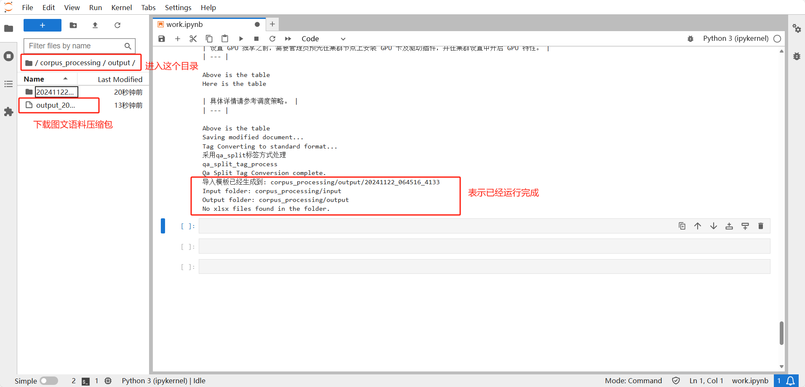
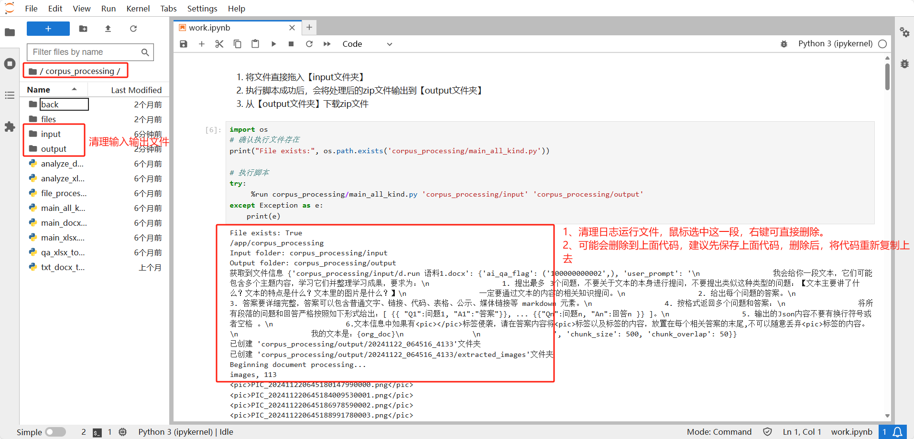

# 图文导入

在导入图文前，需要将导入的语料进行处理后再导入（目前仅支持 Word 和 Excel 的图文处理）。

## 预处理 Docx 文档

1. 直接支持带图文的 Docx 文档按照约定的字符长度分割

    

2. 也支持手工用 `<split></split>` 标签，提前规划好文档分割段落。

    

    对于 Docx 文档中的图片信息，整理的时候请直接粘贴到文档（不要使用形状或者文本框包裹图片）以免程序无法检测从而遗漏图片的处理。

## 预处理 xlsx 文档

xlsx 文件需要符合固定的模板格式：

Q：问题，A：答案。

对于 xlsx 文档，请按照模板要求整理，插图请尽量放一个在单元格中，尽量不要横跨几个单元格放置。

## 生成图文语料

1. 第一步，登录环境: https://console.d.run/ai-tools/lab? 密码：aitools。

    

2. 第二步，上传语料文件，进入目录 /app/corpus_processing/input 下，上传语料文件到此目录下。

    

3. 第三步，点击运行代码。

    

4. 第四步，下载生成图文语料文件。进行目录/app/corpus_processing/output 下载 zip 文件。

    

5. 第五步，清理环境。清理输入和输出文件，以及清理运行日志文件。

    

    !!! note
        该环境为公共的环境，私有的语料文件操作后，建议执行清理环境操作。

### 导入下载的文件

1. 点击 **语料导入** -> **图文导入**

2. 将处理好的文件上传，并进行向量化，等待处理成功即可
