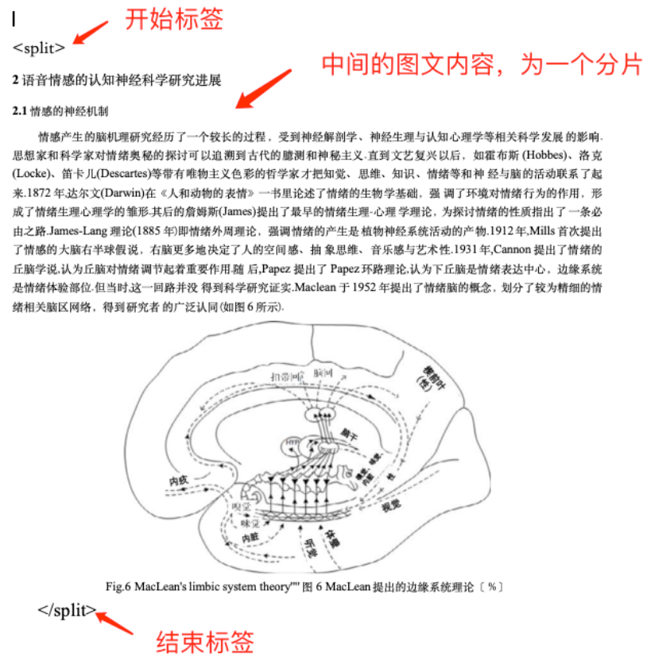

# 图文导入

在图文导入前，需要将导入的语料进行处理后再进行导入操作（目前仅支持word和excel的图文处理）

## docx文档预处理方式

 1. 直接支持带图文的docx文档按照约定的字符长度分割，例如：

 

 2. 也支持手工用`<split></split>`标签，提前规划好文档分割段落。

 


    对于 Docx 文档中的图片信息，整理的时候请直接粘贴到文档（不要使用形状或者文本框包裹图片）以免程序无法检测从而遗漏图片的处理。


## xlsx文档的预处理方式

 xlsx 文件需要符合固定的模板格式，模板形式详见下图。

 

 Q：问题，A：答案。

    对于 xlsx 文档，请按照模板要求整理，插图请尽量放一个在单元格中，尽量不要横跨几个单元格放置。

## 语料处理

### 准备环境

- `/home/aitools/input`    请替换成实际输入文件的目录

- `/home/aitools/output`   请替换成实际输出处理后文件的目录

```shell
#主机上创建输入、输出目录
mkdir -p /home/aitools/output /home/aitools/input
chmod 777 -R /home/aitools/output /home/aitools/input
#运行常驻服务到后台
docker run -d -p 8888:8888 --name aitools \
-v /home/aitools/output:/app/corpus_processing/output \
-v /home/aitools/input:/app/corpus_processing/input \
-e JUPYTER_TOKEN=aitools \
--restart=always xxxxxx/aitools:4.3 
```

### 数据处理

1. 文件上传到预设的输入目录`【/home/aitools/input】`

2. 使用命令run在工具镜像中的脚本

`docker exec aitools sh run.sh`

### 将处理好的文件导入

1. 点击语料导入，图文导入

2. 将处理好的文件夹上传数据，并进行向量化，待处理成功后即可。