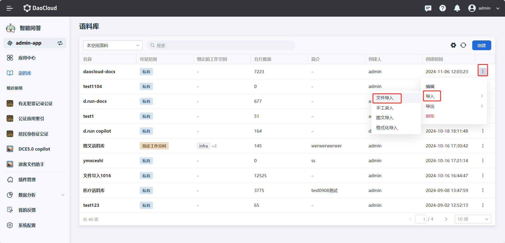
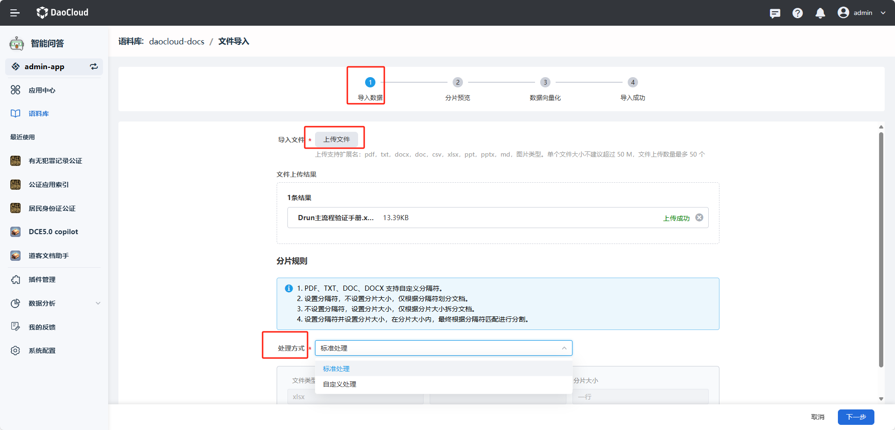
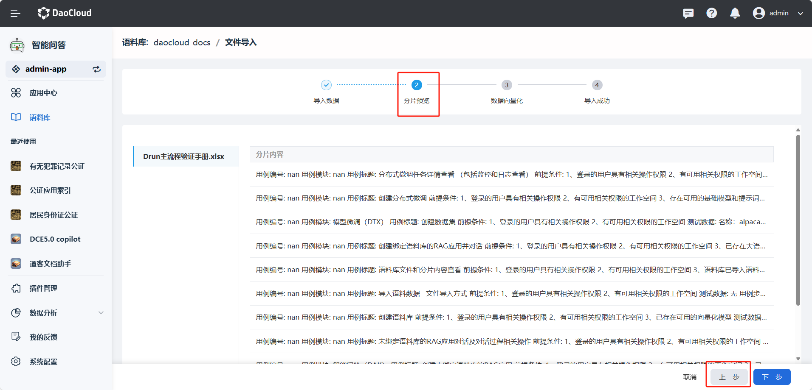
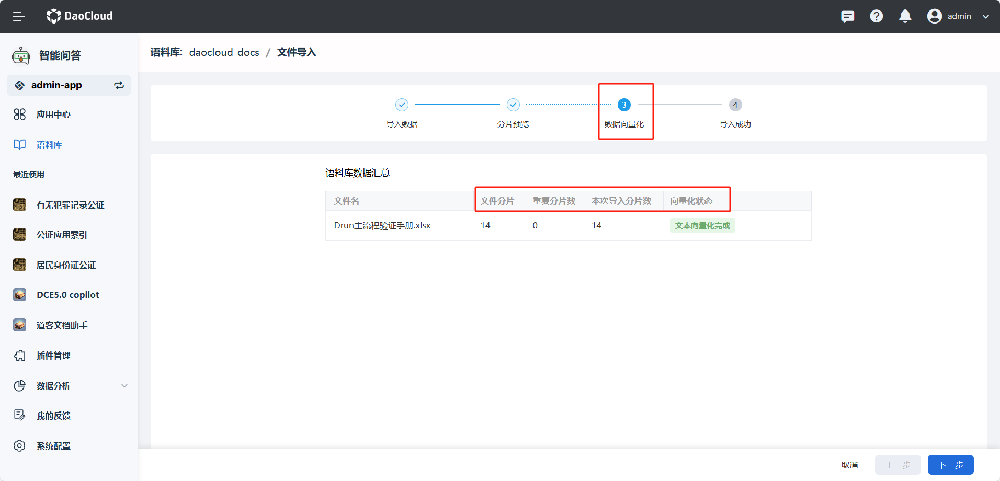

# 文件导入

1. 点击语料库旁的 **┇** 按钮，选择 **文件导入** 方式。

    

1. **导入数据** ：点击 **上传文件**，并选择文件分片的处理方式：标准处理、自定义处理（即插件处理，请到插件接入处查看）

    

    !!! note

        - 目前支持 pdf、txt、docx、doc、csv、xlsx 等格式，单个文件的大小不建议超过 50M，文件上传数量限制为 50 个。
        
        - 分片规则之标准处理。
   
            ```template
            1. PDF、TXT、DOC、DOCX 支持自定义分隔符；
            2. 设置分隔符，不设置分片大小，仅根据分隔符划分文档；
            3. 不设置分隔符，设置分片大小，仅根据分片大小拆分文档；
            4. 设置分隔符并设置分片大小，在分片大小内，最终根据分隔符匹配进行分割。
            ```

1. **分片预览** ：预览分片是否正确，如果不正确可以回到上一步修改分片规则或文件内容。

    

1. **数据向量化** ：查看文件分片数量、重复分片数量、本次导入分片数以及向量化状态，当向量化处理成功后，点击 **下一步**

    

1. 待文件状态为文件处理完成后，点击 **确定**

    
