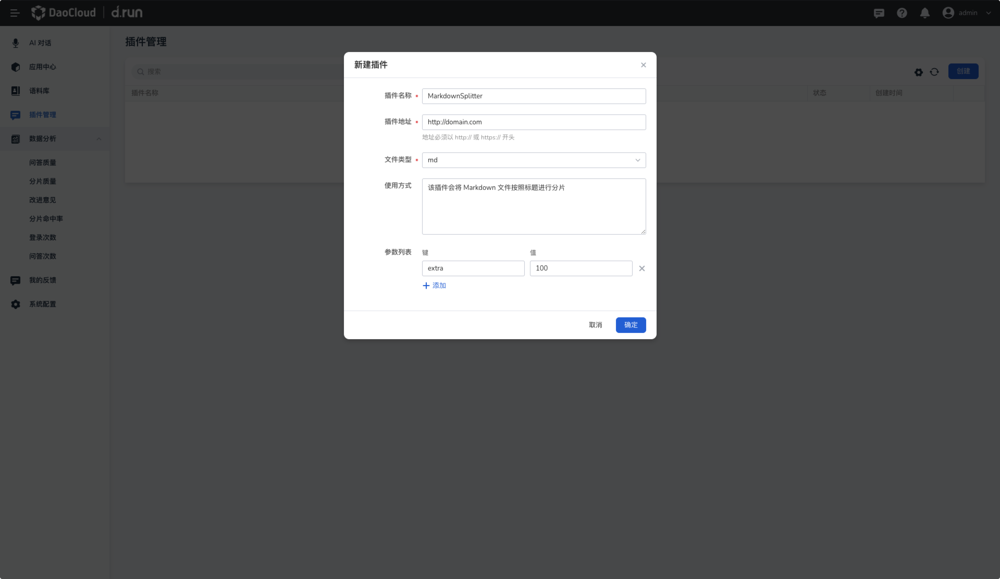

# 分片插件实现与集成指南

本文档介绍了如何实现一个分片插件，并将其集成到系统中。

例如，你可以部署一个插件，该插件将接收 Markdown 格式的文本，然后将其按照标题进行分片，最后将插件添加到系统。现在就可以在语料库中导入 Markdown 格式的文本，并选择该插件进行分片。

## 实现分片插件

### 设计插件功能

在设计插件功能时，需要确定以下几点：

- **输入格式：** 插件将接收什么类型的文本作为输入？在本示例，我们将接收 Markdown 格式的文本作为输入。
- **分片标准：** 根据什么标准将文本进行分片？在本例中，我们将根据 Markdown 文档的标题进行分片。

### 实现插件功能

编写代码实现插件功能。下面是一个示例代码的框架：

```python
from markdown_splitter import MarkdownSplitter

def import_markdown_file(file_path):
    # 读取 Markdown 文件内容
    with open(file_path, 'r', encoding='utf-8') as file:
        markdown_text = file.read()

    # 使用插件进行分片
    splitter = MarkdownSplitter()
    splitted_text = splitter.split_by_heading(markdown_text)

    # 处理分片后的文本
    # ...
```

将分片功能暴露成 http 服务，接口如下：

#### 请求信息

- **HTTP 方法**: POST
- **请求 URL**: `/embeddings/FileSplitAndLocalEmbedDoc`
- **支持格式**: JSON

#### 请求体

请求体应包含待处理文档的内容。文档应采用 JSON 格式，例如：

```json
{
  "fileGetPath": "http://xxx/file.md",
  "params": {
    "key1": "value1",
    "key2": "value2"
  }
}
```

| 名称        | 类型   | 必填 | 描述                                        |
| ----------- | ------ | ---- | ------------------------------------------- |
| fileGetPath | string | 是   | 文件路径                                    |
| params      | object | 否   | 自定义参数， key 为 string，value 为 string |

#### 响应信息

- **状态码**: 200 OK
- **内容类型**: JSON

#### 响应体

响应体将包含处理后的嵌入结果，格式如下：

```json
{
  "content": [
    {
      "orgDoc": "h1: 流沙之战\n作者：Micky Neilson\n\n正午的太阳坚定地凝视着希利苏斯的流沙，... 暴力。",
      "pageIndex": 0
    }
  ],
  "resultCode": "200800000001",
  "resultMessage": "success"
}
```

| 名称          | 类型    | 必选 | 中文名 说明                                  |
| ------------- | ------- | ---- | -------------------------------------------- |
| content       | object  | true | 分片列表                                     |
| orgDoc        | string  | true | 分片内容                                     |
| pageIndex     | integer | true | 分片页码                                     |
| resultCode    | string  | true | 状态码 200800000001 成功， 200800000002 失败 |
| resultMessage | string  | true | 状态描述 success/failed                      |

### 测试插件功能

在实现插件功能后，务必进行测试以确保其正常运行。可以编写单元测试或手动测试来验证插件的正确性。

## 将插件集成到系统中

在系统中添加插件接口，使得语料库模块可以调用插件的功能。

### 添加插件接口

1. 在 **插件管理** 页面中，点击 **创建** 按钮。

    

2. 参考下列要求填写插件信息，并点击 **确定** 。

    - **插件名称：** 名称可以包含大小写字母、数字、连字符（"-"）、中文，最长 63 个字符。
    - **插件地址：** 插件的地址应以 "https://" 或者 "http://" 开头。
    - **文件类型：** 插件处理的文件类型，当前支持的文件类型包括 pdf、txt、docx、doc、csv、xlsx、ppt、md。
    - **使用方式：** 插件的功能介绍，可以包括分片的方法和其他功能说明。
    - **参数列表：** 键值对，描述在分片的时候需要填写对应参数的值，例如 key1:value1, key2:value2。

    

!!! success

    填写正确信息并点击确定后，页面会提示创建成功。

    

### 使用插件

在本例中，可以在语料库导入模块中调用插件功能，以在导入 Markdown 类型文件时进行分片。
