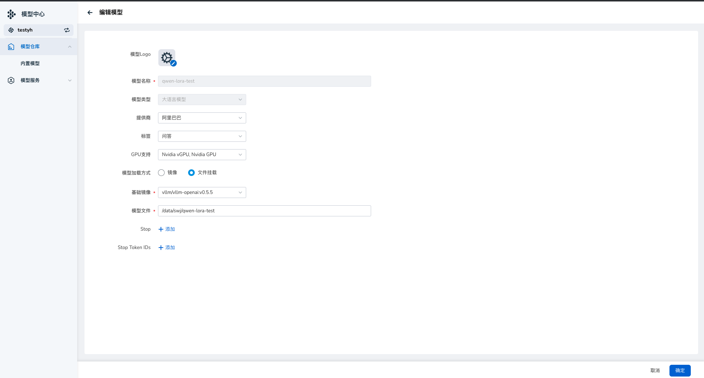
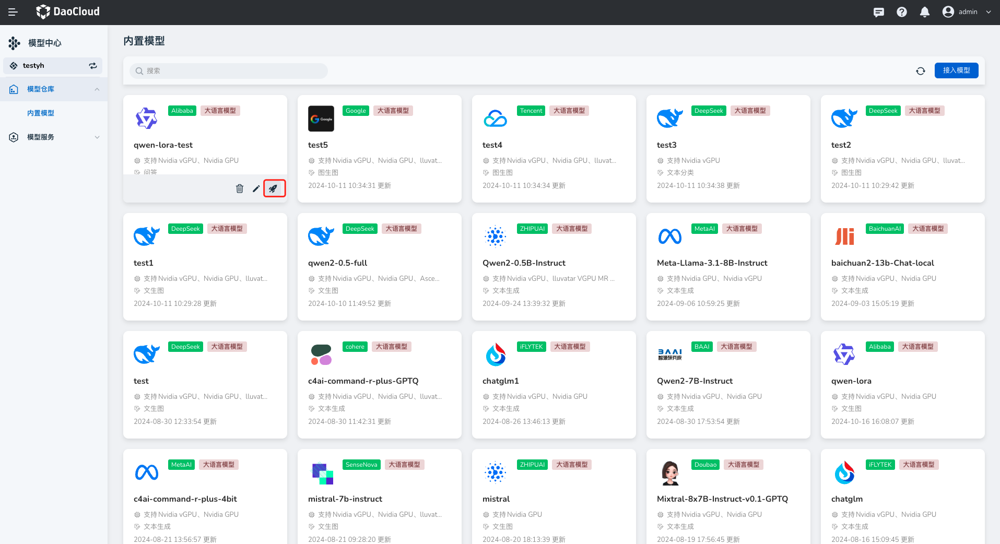
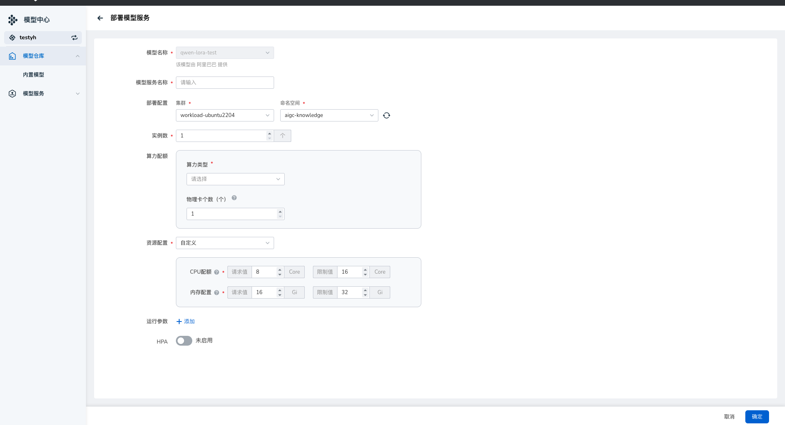
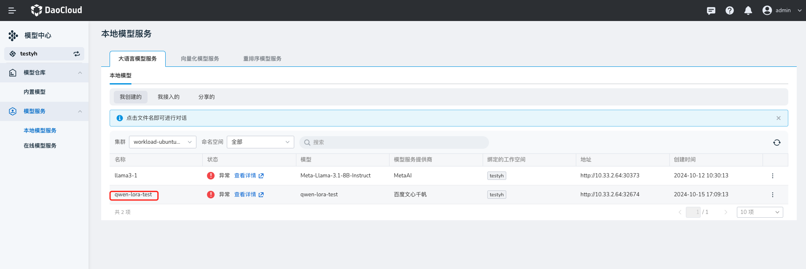

# 模型微调快速入门手册

## 操作步骤

- 前置要求准备
- 创建数据集
- 创建参数组
- 创建微调实验
- 部署微调模型
- 对话

## 前置要求

1. 已购买算力集群，并且该算力集群被加入当前用户所在的 workspace 中
2. 集群有可用的大模型（目前微调只适用与 llama2-7b 模型）
3. 已准备本地/远程数据集，数据集格式为 Q&A（目前仅支持 CSV 格式且文件不超过 50M）

## 创建数据集

1. 点击创建 **数据集**

2. 填写表单

- 输入数据集名称（不支持中文，长度限制 63 字符）。
- 为数据集添加自定义标签。
- 选择数据集语言，当前支持中文/英文。
- 选择要创建的数据集所属的集群以及命名空间，注意：数据集所在集群/命名空间应该和微调实验所属集群/命名空间保一致。
- 根据数据集的属性，设置授权协议。
- 根据数据集的大小，选择词条的数目。
- 根据数据集属性，选择数据集被应用的任务的类型，同时支持添加子类型。
- 配置数据集的信息，可以上传本地数据集文件配置三种类型的数据集地址，或者设置插件，配置参数让插件拉取数据集。
- 数据集的特征映射填写数据集中文件的表头。
- 该数据集分为两列，列名分别为：question/answer。

> 点击 [DCEdata_en_test.csv](images/DCEdata_en_test.csv) 可下载该测试集文件。
> 点击 [DCEdata_en_Trainning.csv](images/DCEdata_en_Trainning.csv) 可下载该训练集文件。
> 点击 [DCEdata_en_validation.csv](images/DCEdata_en_validation.csv) 可下载该验证集文件。

## 创建参数组

在 **模型微调** -> **数据集** 中，点击 **创建** 按钮。

- 设置参数组基本信息，参数组名称以及微调类型和所属集群以及命名空间，目前支持的微调类型为：SFT
- 按照需要配置参数组信息，点击右下角确认完成参数组的创建

点击 **确认** 创建参数组

以 DCE 参数组为例：

## 创建微调实验

1.  在 **模型微调** -> **数据集** 中，点击 **创建微调实验** 按钮

2.  填写表单

    - 实验名称：由小写字母、数字字符或“-”组成，并且必须以字母或数字字符开头及结尾。
    - 选择评估方式：实验中对模型使用的评分准则。
    - 选择命名空间。

- 任务名称：由小写字母、数字字符或“-”组成，并且必须以字母或数字字符开头及结尾。
- 选择算力类型并填写物理卡个数。

!!! info

      当前模型服务仅支持Nvidia的GPU，模型会根据物理卡个数在GPU上进行分布式微调。

- CPU 配额：通常需要使用多核 CPU 来加速训练和推理过程。具体的 CPU 配额需要根据任务的需求和可用的硬件资源来确定。
- 内存配置：根据模型的大小和数据集的大小来确定内存需求，并根据需要调整内存配置。

  推荐 CPU 配额和内存配置请求值为 **16** Core，限制值为 **32** Core。

!!! note

      两者的请求值皆不可超过限制值。

- 选择实验中要使用的 **基础大模型** 、 **数据组** 以及 **参数组** 。

- 若要设置多个微调任务，可点击左下角 **添加任务** 创建新任务。

3.  点击右下角 **确认** 按钮创建微调实验。

## 部署微调模型

在 **模型仓库** -> **内置模型** 的微调模型中，可以查看运行成功的实验结果。

1. 点击右侧的 **...** ，在弹出的选项中选择 **部署** 。

   

2. 填写模型服务名称、命名空间、算力配额、资源配置后点击 **确定** （注：推荐 CPU 配额和内存配置请求值为 **16** Core， **32** Gi）。

   

3. 创建成功，接下来可以通过部署的模型提供服务

## 模型服务对话

1. 微调模型部署成功后，可以在 **模型服务** -> **本地模型服务** -> **微调模型** 勾选模型服务后，
   点击右侧 **对比对话** 即可与该模型 **对话**
   （注：最多可选中三个微调模型进行对话）。

2. 可以输入训练集中的问题，点击发送给微调模型，以此验证模型微调的效果，微调模型会回答用户提出的问题。

