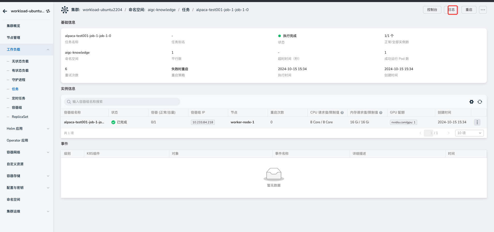

---
hide:
  - toc
---

# 微调实验

## 创建微调实验

1. 在 **模型微调** -> **分布式微调** 中，点击 **创建** 按钮

    

2. 填写表单

    **基本信息：**

    

    - 实验名称：由小写字母、数字字符或“-”组成，并且必须以字母或数字字符开头及结尾。
    - 选择部署位置。
    - 基础模型：选择微调实验支持的模型;
    - 提示词模版：与基础模型适配的模版，instruct、chat模型模版和模型一定要适配、base模型影响不大，但是微调过后如果再进行微调，就要选和第一次一样的模版;
    - 微调方法：根据需求选择合适的微调方法;
    - 训练阶段：根据需求选择合适的训练的阶段;
    - 训练数据集：目前只支持aplaca格式。
    
    **任务配置**
    
    

     - 任务名称：由小写字母、数字字符或“-”组成，并且必须以字母或数字字符开头及结尾。
     - 选择算力类型并填写物理卡个数。
     - 填写资源配置
    
    !!! info
        当前模型服务仅支持Nvidia的GPU，模型会根据物理卡个数在GPU上进行分布式微调

    **任务配置参数设置**
    
    
    
    **超参数配置**

    - 任务并行数: 同时运行的任务数量(控制多机)。
    - 物理卡数: 用于训练的物理GPU或TPU卡的数量（控制每台机器使用的卡数，目前只支持GPU）。
    - 学习率: 模型参数更新的步长，学习率过高可能导致训练不稳定，过低可能导致收敛缓慢。推荐取值: 1e-5 至 1e-3，通常从1e-4开始调整。
    - 训练轮数: 完整地遍历训练数据集的次数。推荐取值: 1-10，视数据集大小和计算资源而定，一般做微调1到3轮就足够。
    - 最大梯度范数: 用于控制梯度的最大值，以避免梯度爆炸问题。推荐取值: 0.5-1.0，视具体情况而定。
    - 最大样本数： 每次训练使用的最大样本数量，通常用于调试或预训练阶段。推荐取值: 根据硬件资源确定，通常设置为None（不限制）。
    - 计算类型: 指定训练时的计算精度类型。推荐取值: FP16，若硬件支持可选择混合精度以加速训练。
    - 截断长度:输入分词后的最大长度 。
    - 批处理大小: 每次训练中输入模型的样本数量。较大的批处理大小可提高训练效率，但也需要更多的显存。推荐取值: 8-64，视显存容量和模型复杂度而定。资源充足的情况下，批处理大小越大，效果越好。
    - 梯度累计解释: 梯度累计的次数，即在更新模型前积累梯度的次数。推荐取值: 1-8，通常与批处理大小的实际可行性有关。
    - 验证集比例解释: 用于验证的数据集在整个数据集中的比例。根据需求设定
    - 学习率调节器解释: 调整学习率的策略，如预热、线性下降或余弦退火。推荐取值: 预热加线性衰减，或余弦退火。根据训练情况和目标任务选择。
    
    **LoRA参数配置**

    - LoRA秩解释: LoRA 秩表示用于低秩分解的秩值，它决定了学习的参数量。较高的秩值会增加参数量，通常在训练复杂模型时使用。推荐取值: 4-16，视模型大小和任务复杂度而定。
    - LoRA缩放系数解释: 缩放系数用于放大或缩小LoRA的输出，在微调过程中可以调整其影响力。较高的缩放系数会使LoRA的贡献更大。推荐取值: 8-32，通常使用16作为默认值，并根据实验结果调整。
    - LoRA随机丢弃解释: LoRA随机丢弃用于在训练过程中随机丢弃部分LoRA层的输出，以防止过拟合并增强模型的泛化能力。推荐取值: 0.1-0.3，视过拟合程度和数据集规模而定。
    - LoRA学习率比例解释: LoRA学习率比例是指LoRA部分的学习率相对于基础模型学习率的比例。较高的学习率比例可以加速LoRA参数的学习，但也可能导致不稳定性。推荐取值: 0.5-1.0，通常从0.5开始，视训练稳定性进行调整。
    高级配置
    - 量化等级: 量化等级指模型参数的量化精度，可以选择int4或int8来减少模型的计算量和内存占用。选择none则不进行量化。推荐取值: none, int4, int8，根据模型性能要求和计算资源选择。
    - 量化方法: 量化方法指定了使用哪种算法进行模型的量化。常见方法包括bnb（Bits-and-Bytes），hqq（High Quality Quantization），和etqq（Extreme Tiny Quantization）。根据任务要求和实验结果选择。
    - RoPE插值方式: RoPE（旋转位置编码）插值方式用于处理旋转位置编码的不同实现方案，影响模型对位置信息的处理。
    - 加速方式: 加速方式指使用的模型加速技术，以提高训练和推理速度。unslosh和flashattention2是常用的加速方法。根据硬件支持情况和加速效果选择,同时需要注意使用的模型是否适用以上的加速模式。
    
    **其他参数配置**
    
    - 日志间隔: 日志间隔指在训练过程中记录日志的频率，通常以训练步数为单位。适当的日志间隔可以帮助监控训练进度和模型性能。推荐取值: 10-1000步，视数据集大小和训练需求而定。
    - 保存间隔: 保存间隔指模型权重的保存频率，通常以训练步数或时间为单位。较短的保存间隔可以减少训练中途崩溃时的损失。推荐取值: 1000-5000步，视训练时长和数据集大小而定。
    - 预热步数: 预热步数是在正式训练前的学习率线性增加阶段，通常用于避免模型在初期出现过大的梯度更新。推荐取值: 500-2000步，视训练总步数和学习率策略而定。
    - NEFTune噪声参数: NEFTune噪声参数控制在NEFTune方法中引入的噪声水平，以增强模型的泛化能力。推荐取值:5，视具体任务和噪声敏感性而定。
    - 优化器: 优化器是指用于更新模型参数的算法。常见的优化器包括Adam、SGD、Adafactor等，选择合适的优化器对训练效率和效果至关重要。推荐取值: AdamW
    
    **添加任务按钮**
    
    

3. 点击右下角 **确定** 按钮创建微调实验。

## 查看微调实验详情

点击微调实验的名称，进入微调实验详情页。

## 查看微调实验日志

在详情页面，点击**查看日志**，进入微调任务的详情页面，点击***日志**，即可查看微调实验的日志。

## 查看微调实验监控
在详情页面，点击**监控**，进入微调任务的详情页面，点击***监控**，即可查看微调实验的监控。

## 删除微调实验

若想删除某个微调实验，可点击右侧 **┇** ，在弹出菜单中选择 **删除** 。

!!! note

    删除操作不可逆，请谨慎操作。
