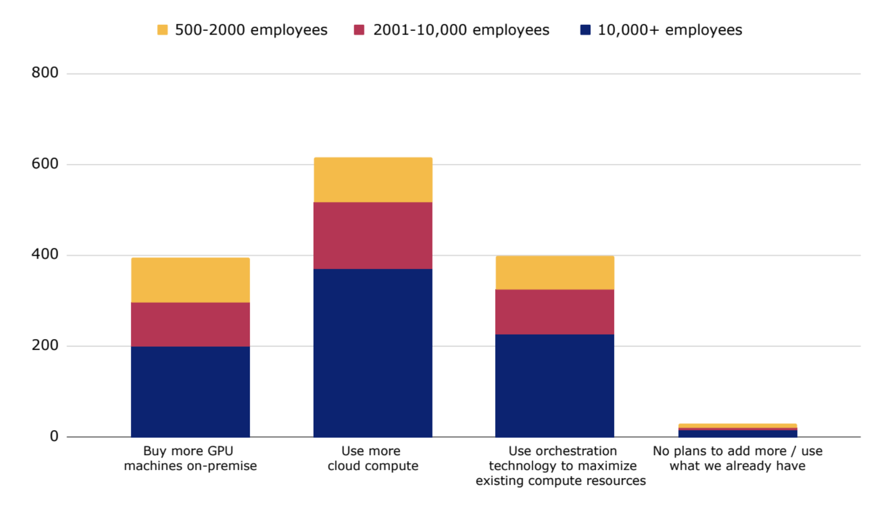
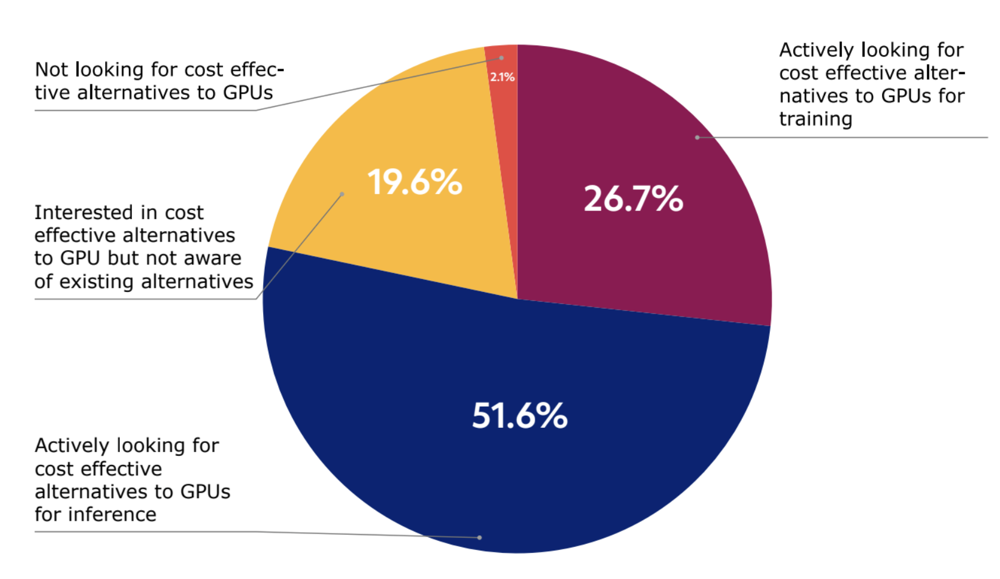
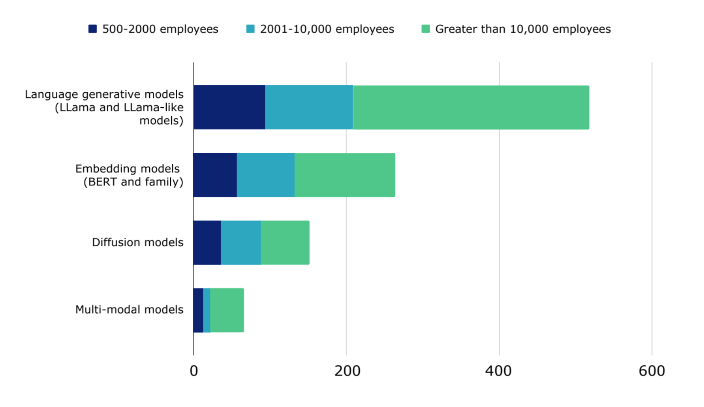
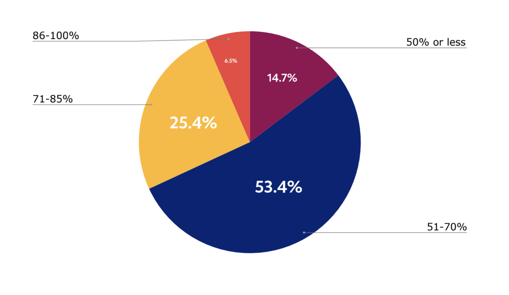

# The State of AI Infrastructure at Scale 2024

> from [clear.ml blog](https://clear.ml/blog/the-state-of-ai-infrastructure-at-scale-2024)

In March of this year, ClearML released the results of a global AI survey conducted in collaboration with FuriosaAI and the Artificial Intelligence Infrastructure Alliance (AIIA). The new report, titled "2024 AI Infrastructure Scale Status: Revealing Future Prospects, Key Insights, and Business Benchmarks," includes responses from AI/ML and technology leaders at 1,000 companies of various sizes across North America, Europe, and the Asia-Pacific region.

The survey focuses on gaining more insights into global AI infrastructure plans, including respondents':

1. Computing power infrastructure growth plans;
2. Current experiences with scheduling and computing solutions;
3. Usage and plans for models and AI frameworks in 2024.

The report delves into respondents' current scheduling, computing, and AI/ML demands for training and deploying models and AI frameworks planned for 2024-2025.

Noam Harel, Chief Marketing Officer and General Manager of ClearML North America, stated: "Our research shows that while most organizations plan to expand their AI infrastructure, they need to prioritize the right application scenarios; otherwise, it will be challenging to quickly and massively deploy generative AI."

"We also explored the numerous challenges organizations face with current AI workloads and how they are formulating ambitious future plans in search of high-performance, cost-effective methods to optimize GPU utilization (or find alternatives to GPUs), leveraging seamless end-to-end AI/ML platforms to drive efficient, autonomous computing orchestration and scheduling to maximize utilization."

## Key Findings

1. **96% of companies plan to expand their AI compute capacity and investment with availability, cost, and infrastructure challenges weighing on their minds.**

    Nearly all respondents (96%) plan to expand their AI compute infrastructure, with 40% considering more on-premise and 60% considering more cloud, and they are looking for flexibility and speed. The top concern for cloud compute is wastage and idle costs. 

    When asked about challenges in scaling AI for 2024, compute limitations (availability and cost) topped the list, followed by infrastructure issues. Respondents felt they lacked automation or did not have the right systems in place.

    The biggest concern for deploying generative AI was moving too fast and missing important considerations (e.g. prioritizing the wrong business use cases). The second-ranked concern was moving too slowly due to a lack of ability to execute.

    

    Figure 1: 96% of companies plan to expand their AI compute capacity.

2. **A staggering 74% of companies are dissatisfied with their current job scheduling tools and face resource allocation constraints regularly, while limited on-demand and self-serve access to GPU compute inhibits productivity.**

    Job scheduling capabilities vary, and executives are generally not satisfied with their job scheduling tools, and report that productivity would dramatically increase if real-time compute was self-served by data science and machine learning (DSML) team members. 

    74% of respondents see value in having compute and scheduling functionality as part of a single, unified AI/ML platform (instead of cobbling together an AI infrastructure tech stack of stand-alone point solutions), but only 19% of respondents actually have a scheduling tool that supports the ability to view and manage jobs within queues and effectively optimize GPU utilization.

    

    Figure 2: 74% of respondents see value in having compute and scheduling functionality as part of a single, unified AI/ML platform.

    Respondents reported they have varying levels of scheduling functionality and features, leading with quota management (56%), and followed by Dynamic Multi-instance GPUs/GPU partioning (42%), and the creation of node pools (38%). 

    65% of companies surveyed use a vendor-specific solution or cloud service provider for managing and scheduling their AI/ML jobs. 25% of respondents use Slurm or another open source tool, and 9% use Kubernetes alone, which does not support scheduling capabilities. 74% of respondents report feeling dissatisfied or only somewhat satisfied with their current scheduling tool.

    The ability for DSML practitioners to self-serve compute resources independently and manage job scheduling hovers between 22-27%. However, 93% of survey respondents believe that their AI team productivity would substantially increase if real-time compute resources could be self-served easily by anyone who needed it.

3. **The key buying factor for inference solutions is cost.**

    To address GPU scarcity, approximately 52% of respondents reported actively looking for cost-effective alternatives to GPUs for inference in 2024 as compared to 27% for training, signaling a shift in AI hardware usage. Yet, one-fifth of respondents (20%) reported that they were interested in cost-effective alternatives to GPU but were not aware of existing alternatives.

    

    Figure 3: 52% of respondents reported actively looking for cost-effective alternatives to GPUs for inference in 2024.

    This indicates that cost is a key buying factor for inference solutions, and we expect that as most companies have not reached Gen AI production at scale, the demand for cost-efficient inference compute will grow.

4. **The biggest challenges for compute were latency, followed by access to compute and power consumption.**

    Latency, access to compute, and power consumption were consistently ranked as the top compute concerns across all company sizes and regions. More than half of respondents plan to use LLMs (LLama and LLama-like models) in 2024, followed by embedding models (BERT and family) (26%) in their commercial deployments in 2024. Mitigating compute challenges will be essential in realizing their aspirations.

    

    Figure 4: More than half of respondents plan to use LLMs (LLama and LLama-like models) in 2024.

5. **Optimizing GPU utilization is a major concern for 2024-2025, with the majority of GPUs underutilized during peak times.**

    40% of respondents, regardless of company size, are planning to use orchestration and scheduling technology to maximize their existing compute infrastructure.  

    When asked about peak periods for GPU usage, 15% of respondents report that less than 50% of their available and purchased GPUs are in use. 53% believe 51-70% of GPU resources are utilized, and just 25% believe their GPU utilization reaches 85%. Only 7% of companies believe their GPU infrastructure achieves more than 85% utilization during peak periods.

    

    Figure 5: 15% of respondents report that less than 50% of their available and purchased GPUs are in use.

    When asked about current methods employed for managing GPU usage, respondents are employing queue management and job scheduling (67%), multi-instance GPUs (39%), and quotas (34%). Methods of optimizing GPU allocation between users include Open Source solutions (24%), HPC solutions (27%), and vendor-specific solutions (34%). Another 11% use Excel and 5% have a home-grown solution. Only 1% of respondents do not maximize or optimize their GPU utilization.

6. **Open Source AI solutions and model customization are top priorities, with 96% of companies focused on customizing primarily Open Source models.**

    Almost all executives (95%) reported that having and using external Open Source technology solutions is important for their organization.

    

    Figure 6: 96% of companies surveyed are currently or planning to customize Open Source models in 2024.

    In addition, 96% of companies surveyed are currently or planning to customize Open Source models in 2024, with Open Source frameworks having the highest adoption globally. PyTorch was the leading framework for customizing Open Source models, with 61% of respondents using PyTorch, 43% using TensorFlow, and 16% using Jax. Approximately one-third of respondents currently use or plan to use CUDA for model customization. 

## About the Survey Research Authors

The AI Infrastructure Alliance is dedicated to bringing together the essential building blocks for the Artificial Intelligence applications of today and tomorrow. To learn more, visit https://ai-infrastructure.org/.

FuriosaAI is a semiconductor company designing high-performance data center AI accelerators with vastly improved power efficiency. Visit https://www.furiosa.ai/comingsoon to learn more.

As the leading open source, end-to-end solution for unleashing AI in the enterprise, ClearML is used by more than 1,600 enterprise customers to develop highly repeatable processes for their entire AI model lifecycles, from product feature exploration to model deployment and monitoring in production. To learn more, visit the company’s website at https://clear.ml.
