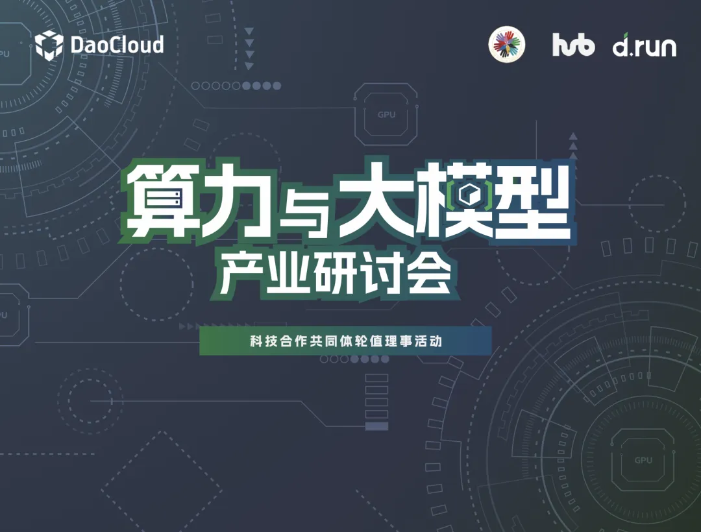
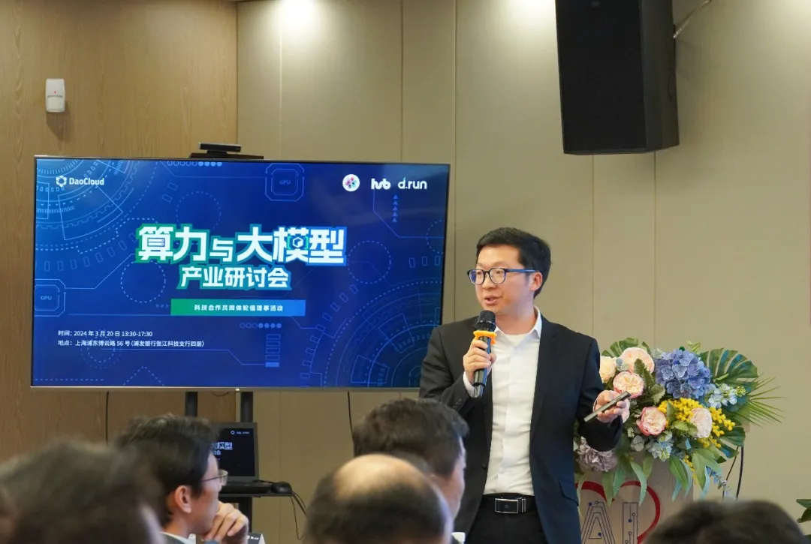
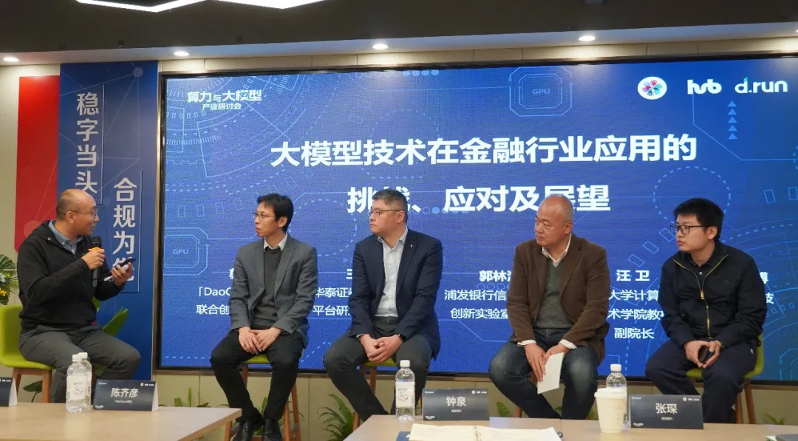

# The Financial Industry Enters the Era of LLMs, Computational Infrastructure Becomes the Key to Victory

To build an autonomous, secure, stable, and powerful computational infrastructure in the financial industry, "DaoCloud" has organized this seminar on computational power and the LLM industry as a member of the Shanghai Pudong Development Bank Technology Cooperation Community. Experts from the financial industry, members of the Pudong Innovation Community, and LLM industry specialists were invited to exchange ideas and explore new models of computational service.

As the host, the Zhangjiang Technology Branch of Pudong Development Bank delivered an opening speech expressing the hope to leverage technology and data more effectively to provide high-quality services to customers.

## Breaking the Computational Bottleneck in Banking

We see the certainty of Chinese enterprises embracing LLMs and AI applications in the financial industry, making it especially important to find a suitable development path for LLMs for Chinese enterprises.

The CEO of "DaoCloud," Chen Qiyan, shared: **General artificial intelligence is a triangle, where computational power is an important part, but there are two other equally important elements: algorithms and data.**

Faced with the advantages of overseas computational power, we may fall into a frenzy of anxiety, questioning how much computational power we need. We must realize that when computational power cannot become our strength, we should strive to expand our advantages along the axes of the other two elements. Once you truly enter this field, you will find that achieving this in the Chinese market is very challenging due to an incomplete understanding of the entire architecture; some may even mistakenly believe that building computational infrastructure is merely about purchasing GPUs.

However, implementing AI applications isn't just about a few GPU cards; **it requires the support of an entire ecosystem.** **In addition to needing GPU hardware, effective computational management and scheduling are essential**, which includes a series of network and storage technologies based on cloud-native Kubernetes. The current focus of computational scheduling is the ability to link thousands of GPUs to complete tasks.

"DaoCloud," as a company that has contributed nearly 10 years in the upstream field of cloud-native Kubernetes, applies cloud-native technology to integrate AI computational power and LLMs, supporting enterprises in better managing computational scheduling and heterogeneous management of GPUs from various enterprises to ensure business continuity and stability.

In addressing the computational bottleneck in the banking sector, on one hand, we can use cloud-native technology to absorb the impact of AI while satisfying the requirements of domestic innovation. On the other hand, it is also suggested that financial enterprises consider **combining finance with computational infrastructure** to jointly expand the computational track, which is a promising future direction.

## Pudong Development Bank's "Tropical Rainforest"

The Inclusive Finance Department of Pudong Development Bank's Shanghai Branch shared the development journey of the bank's financial technology, emphasizing its commitment to creating a rich ecosystem referred to as the "tropical rainforest." This ecosystem includes not only large trees (large listed companies) but also growing saplings (companies preparing for listing) and flourishing shrubs (high-growth companies), all sharing the same soil and sky. The tropical rainforest ecosystem encompasses investors, government agencies, and other service providers, as well as the upstream and downstream of the industry chain.

In the face of tech finance, **Pudong Development Bank adheres to the philosophy of symbiosis, coexistence, mutual renewal, and self-growth, advocating trust and mutual assistance while growing robustly together.**

## From Theory to Practice with LLMs

The LLM team from the Information Technology Department of Nanyang Commercial Bank (China) shared their practical experiences in implementing LLMs in the banking sector. Currently, the input-output ratio of LLMs is relatively low, and small and medium-sized banks often face resource constraints. Nanyang Commercial Bank chose to start with a knowledge base to promote the construction of intelligent assistants based on LLMs. While it may seem like a simple Q&A format, it involves new technology applications and significant engineering work behind the scenes. The LLM knowledge base can create different Q&A robot scenarios based on different employee roles and reduce the operational pressure on the knowledge base.

In the practical process, we face many challenges, including data privacy and security, knowledge slicing methods, computational scheduling capabilities, algorithm optimization effects, and the hallucination of LLMs, all of which can affect the final results. However, the path to intelligent development is clear. **When facing new phenomena, we often overestimate their short-term impact while underestimating their long-term development.** In the wave of AI development, we feel honored to collaborate with partners, continuously exploring innovations in the field of LLMs.

## The Vitality of LLMs

Xu Yinghui, co-founder of Infinite Light Years, shared some thoughts on the training process of LLMs, offering a perspective different from that of financial practitioners. Xu noted that there is currently little innovation in the structure of model training in the large environment; more attention is given to adjustments when model training does not meet expectations. **The core answer is to generate data.** People believe that OpenAI is powerful not because of a single strong model, but because of the robust, data-centric high-quality data supply chain.

Therefore, achieving the level of **"model help data"** in model training is the future of the LLM era: **a data-centric way of thinking.**

To achieve this, we need to use deep learning algorithms on distributed clusters to extract clean and effective data from massive pre-trained datasets, increasing the value of data. Enterprises need to focus on applying industry experience and rules within the system to ensure that the work of LLMs resembles human thought processes and logic.

Xu emphasized that human cognition actually limits development. There are many paths to Rome, and solutions are not unique; there is no such thing as the strongest LLM. How to make this model adapt to different users, allowing everyone to reach Rome, is the deeper meaning that LLMs bring to society. **The vitality of LLMs comes from adapting to open-ended questions, helping enterprises explore more unknowns within known parameters.**

## Industry and Verticalization as Future Directions for LLMs

Shen, head of the Technology Research and Development Department at Sichuan Tianfu Bank, shared insights on their cooperation with "DaoCloud" in containerizing financial business. They have gradually upgraded Tianfu's fintech capabilities and collaborated with Peking University to develop the CodeShell code LLM. With a top-notch AI team and fully autonomous intellectual property over the LLM, Tianfu can deeply customize and privately deploy solutions that meet its business understanding and scene landing. After high-quality public data has been exhausted, **the vast private data of enterprises deserves deeper exploration.** Due to reasons such as enterprise data security, banking compliance, and improving the efficiency and sustainability of LLMs, **the deep customization of LLMs towards industry and verticalization will undoubtedly become one of the future development directions.**

Currently, the intuitive advantage of the CodeShell LLM lies in its proficiency in financial knowledge and familiarity with all regulations and product management of Tianfu Bank, as well as its understanding of existing bank customers. This specialization significantly enhances the efficiency of daily work for enterprises. Tianfu Bank also hopes to continuously explore and make progress in the practice of LLMs, striving to remain at the forefront in the era of AI.

## Autonomous Control in Banking Innovation

Yuxin Technology has extensive business cooperation with "DaoCloud" in cloud-native scenarios and possesses 25 years of experience in financial services. It has rich experience in migrating core business applications. The migration application architecture needs to achieve four unchanging aspects:

1. Business processes remain unchanged.
2. Business functions remain unchanged.
3. Business logic remains unchanged.
4. External interfaces remain unchanged.

Ensuring these four constants minimizes the impact of business migration. However, during this process, the overall architecture needs to change, requiring corresponding adjustments to application architecture, database architecture, and disaster recovery for business continuity. Additionally, there are issues with data migration, and handling the evolving financial business and existing financial products requires experience-based tailored solutions.

The head of the Yuxin Technology Innovation Business Department, Xinjun Han, stated:
**In overall architecture design, application, data, and technology architectures need to have corresponding relationships. By breaking down complex issues into smaller components and simplifying them, we can better support the business scenarios of tech finance.**

## Roundtable Discussion

The roundtable segment of this event invited Professor Wang Wei, Vice Dean of the Computer Science and Technology School at Fudan University; Wang Xinming, head of the Platform Development Center at Huatai Securities' Information Technology Department; Guo Linhai, Deputy Director of the Innovation Laboratory at Pudong Development Bank's Information Technology Department; Yang Wenbo, CTO of Feiyu Technology; and Guo Feng, co-founder and CTO of "DaoCloud" to exchange insights on the application of LLMs.

Huatai: Currently, there is a sense of initial amazement followed by a gradual leveling off and a feeling of regret as we delve deeper into the implementation of LLMs. There is still a gap between the application of LLMs in professional fields and our expectations. We **position "LLMs" as revolutionaries, inevitably impacting existing management**. If we can use LLMs to compare historical and real-time data, we can certainly make more accurate judgments in a more mature and stable phase. **The future imagination of LLMs is limitless.** From the perspective of financial practitioners, what we can do now is to enhance data quality and explore more viable scenarios, **seeking an optimal solution for tech finance.**

Fudan: The problems faced by academia in reality are quite similar to those of everyone else. Forming a talent cultivation system that integrates into the era of LLMs is a common challenge we all encounter. **In the era of LLMs, the demand for talent capabilities and training models will differ greatly from before.** The imprecision of LLMs and issues like hallucinations persist. Although there are ways to optimize through model adjustments and knowledge enhancement, we find that what is truly needed is a systematic solution, not just patches for isolated problems.

Feiyu: As a company focused on software development and code security, our perspective is more on the application of LLMs in code. They can perform basic repairs and writing, but currently, the input window is very limited, while actual project code can number in the tens of thousands or even millions of lines, making it difficult to directly output or summarize through LLMs. Moreover, there is some panic about LLMs replacing human jobs, but when you learn to master LLMs, it aligns with a popular saying today: **Question it, understand it, become it. Our relationship with AI will also be mutually beneficial.**

Finally, through this conference, "DaoCloud" hopes to build a more diverse and open platform for cross-border communication with peers in the computational ecosystem and to engage in in-depth discussions with experts across various fields on technologies, business models, and investment opportunities related to computational power and LLMs. We believe that everyone's thoughts on AI computational LLMs extend far beyond this. If you have more ideas you would like to discuss with us, we welcome you to register for the DaoCloud Computational Power Brand Launch Conference on March 28, 2024.

[Register and Try d.run](https://console.d.run/){ .md-button .md-button--primary }
