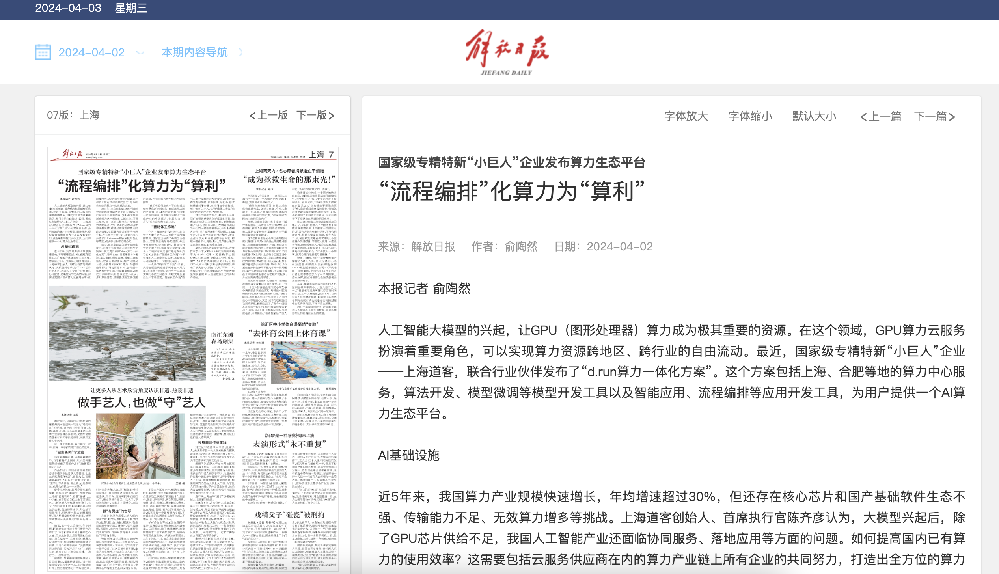

---
hide:
  - toc
---

# "AI Process Orchestration" Transforms computing resource into "Computational Benefits"

!!! info

    National-level specialized and innovative "Little Giant" enterprise launches computing resource ecological platform

    Source: [Jiefang Daily](https://www.shobserver.com/staticsg/res/html/journal/detail.html?date=2024-04-02&id=370048&page=07); Reporter: Yu Taoran

The rise of large AI models has made GPU (Graphics Processing Unit) computing resource an extremely important resource. In this field, GPU computing resource cloud services play a crucial role, enabling the free flow of computing resources across regions and industries. Recently, the national-level specialized and innovative "Little Giant" enterprise, Shanghai DaoCloud, in collaboration with industry partners, launched the "d.run Integrated Computing Solution." This solution includes computing center services in Shanghai, Hefei, and other locations, algorithm development, model fine-tuning tools, and application development tools such as intelligent Q&A and process orchestration, providing users with an AI computing resource ecological platform.

## AI Infrastructure

In the past five years, China's computing industry has experienced rapid growth, with an average annual growth rate exceeding 30%. However, challenges still exist, such as a lack of core chips and a weak domestic basic software ecosystem, insufficient transmission capacity, and an increase in ineffective computing resource. Chen Qiyan, founder and CEO of Shanghai DaoCloud, believes that after the rise of LLMs, in addition to the insufficient supply of GPU chips, China's AI industry also faces issues in collaborative services and practical applications. How to improve the efficiency of existing domestic computing resource? This requires the joint efforts of all enterprises in the computing industry chain, including cloud service providers, to create a comprehensive Integrated Computing Solution.

In 2014, Chen Qiyan's team from the EMC China Research Institute of Yihuanxin embarked on an exploration of AI infrastructure, focusing on the utilization of computing resource. Their goal was to develop a platform capable of orchestrating and optimizing computing resources effectively. This journey led to the establishment of Shanghai DaoCloud, which has since evolved into a national-level "Little Giant" enterprise specializing in computing services.

## The d.run Platform

The newly launched d.run Integrated Computing Solution aims to provide a comprehensive suite of services that cater to the growing demands of AI applications. The platform integrates various resources, including computing centers located in strategic areas like Shanghai and Hefei, to ensure high availability and scalability. It also offers tools for algorithm development and model fine-tuning, making it easier for businesses to harness AI technology without needing extensive in-house expertise.

The platform's intelligent Q&A system and process orchestration capabilities allow users to streamline operations and enhance productivity. By automating processes and facilitating better resource management, the d.run platform transforms raw computing resource into tangible computational benefits, enabling organizations to focus on innovation rather than infrastructure.

## Industry Collaboration

Chen Qiyan emphasizes the importance of collaboration within the industry to overcome existing challenges. By working together with other enterprises, cloud service providers, and technology partners, Shanghai DaoCloud aims to create a robust ecosystem that drives the advancement of AI technologies in China. This collaborative approach is essential for addressing the issues related to GPU supply, enhancing software ecosystems, and maximizing the efficient use of computing resources.

As the demand for AI solutions continues to grow, the d.run platform positions itself as a vital player in the computing resource landscape, providing businesses with the tools and resources necessary to leverage AI effectively. The initiative is expected to not only boost the efficiency of computing resource utilization but also contribute to the overall growth of the AI industry in China.

## Conclusion

The launch of the d.run Integrated Computing Solution marks a significant step forward in the evolution of AI infrastructure in China. By transforming computing resource into computational benefits, Shanghai DaoCloud and its partners are paving the way for a more efficient and innovative AI ecosystem. As the industry continues to evolve, the emphasis on collaboration and integration will be crucial in addressing the challenges and unlocking the full potential of AI technologies.
