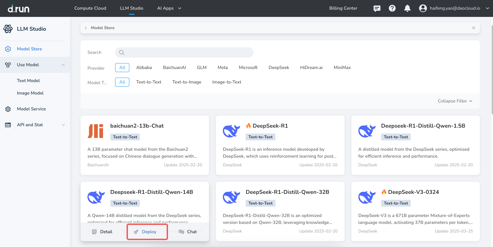
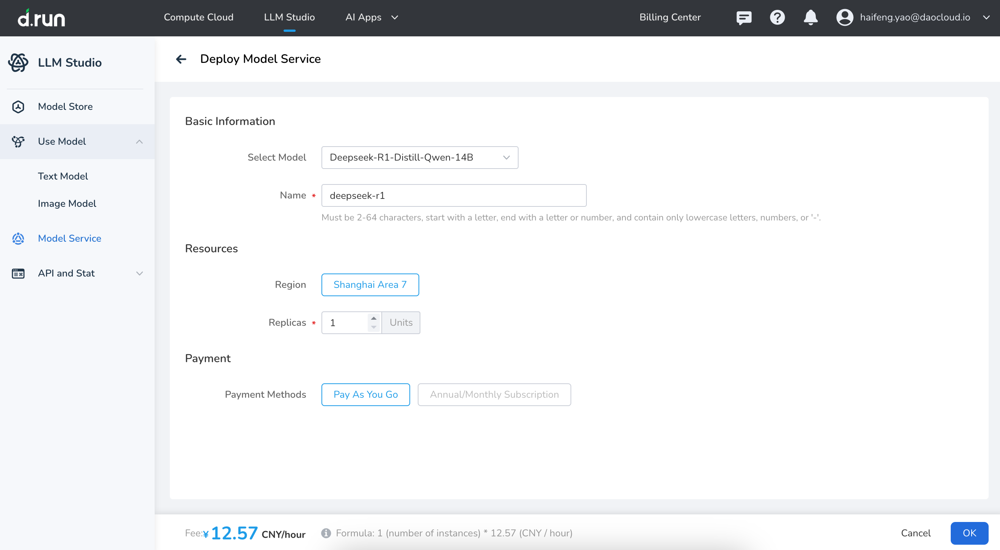
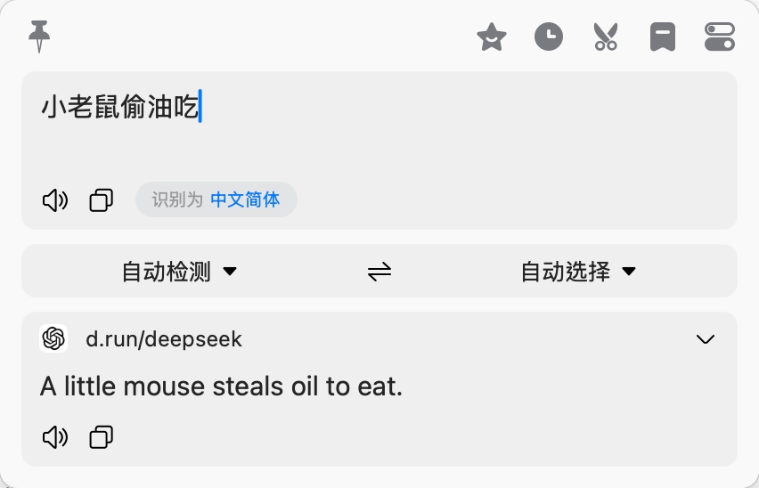

---
hide:
  - toc
---

# Deploy, Invoke, and Try DeepSeek on d.run

d.run currently offers a free one-week trial for DeepSeek models.  
Visit <https://console.d.run/> to try out the following DeepSeek models with one click:

- **DeepSeek-R1**: The full-powered version with 236 billion parameters. It uses a dense Transformer architecture and activates all modules during every inference.  
  It demonstrates strong capabilities in complex reasoning tasks, especially excelling in math reasoning, code generation, and logical deduction.  
  In these high-end application domains, R1 is considered on par with top-tier models like OpenAI's GPT-4, offering much stronger reasoning power than typical general-purpose models.

- **DeepSeek-V3**: Based on a Mixture of Experts (MoE) architecture with 671 billion parameters, activating 37 billion per inference.  
  It performs excellently on general natural language processing tasks and stands out in terms of response speed.

- **DeepSeek-R1-Distill-Qwen-32B**: A distilled model.

- **DeepSeek-R1-Distill-Qwen-14B**: A distilled model.


However, the free trial usually only lasts one week. It is recommended to deploy your own exclusive large model.  
The following uses DeepSeek-R1-Distill-Qwen-14B as an example.

## Deploying the Model

1. In the **Model Plaza**, find DeepSeek-R1-Distill-Qwen-14B and click the **Deploy** button on the card.

    

1. Enter the basic information and resource details, select a billing method, then click **OK**.

    

1. When the system prompts "Deployment Successful" and the status changes from **Deploying** to **Running**,  
   it means the DeepSeek-R1-Distill-Qwen-14B model has been successfully deployed.

    

## Chat with the Deployed Model in drun

In the image above, click **Experience** in the operations column to start chatting with the DeepSeek-R1-Distill-Qwen-14B distilled model.


## Calling the d.run Model from Third-party Apps

You can also call the d.run API from third-party intelligent apps such as VSCode, Bob Translate, Lobe Chat, Cherry Studio, etc.  
This allows you to use the just-deployed DeepSeek-R1-Distill-Qwen-14B model.

### Creating an API Key

To call d.run's model services in a third-party app, you’ll need an API Key.

1. In the d.run LLM service platform, go to **Analytics & Management** -> **API Key Management**, then click **Create** on the right.

    

1. Enter an easily recognizable name, then click **OK**.

    

1. When prompted that the API Key was created successfully, securely save the generated key and click **Close**.

    

1. Return to the API Key list. The newly generated key appears at the top by default.

    

### Calling d.run Model Service

Using the third-party app Bob Translate as an example:

1. After installing it via the App Store, launch Bob and select **Preferences** from the dropdown menu.

    

1. Click **Services** -> **➕**

    

1. Select DeepSeek.

    

1. Fill in the following parameters, enable only d.run’s model service, then click **Save**.

    | **Config Item**         | **Example Value**              |
    |-------------------------|-------------------------------|
    | **Service Name**        | d.run.deepseek                |
    | **API Key**             | Enter the newly generated Key |
    | **Custom API Base URL** | `https://sh-02.d.run`         |
    | **Custom API Path**     | Leave empty or `/v1/chat/completions` |
    | **Model**               | Custom model                  |
    | **Custom Model**        | DeepSeek-R1-Distill-Qwen-14B  |

    

    !!! note

        You can also run the following command in the terminal to check if the model is callable:

        ```bash
        curl 'https://sh-02.d.run/v1/chat/completions' \
         -H "Content-Type: application/json" \
         -H "Authorization: Bearer <replace with your API Key>" \
         -d '{
            "model": "u-3d7a8e49da2a/test14b",
            "messages": [{"role": "user", "content": "Say this is a test!"}],
            "temperature": 0.7
         }'
        ```

1. Now try letting Bob Translate translate a sentence.

    

🎉 Congratulations! The third-party app Bob Translate has successfully called the DeepSeek-R1-Distill-Qwen-14B model deployed in d.run via the API.  
Similarly, you can integrate any DeepSeek model deployed in d.run with any third-party intelligent application.
