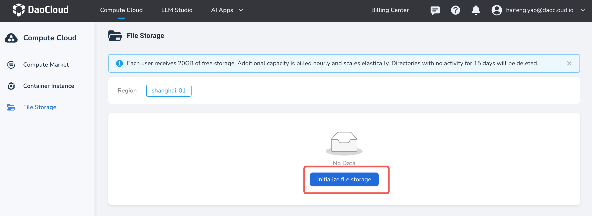

---
hide:
  - toc
---

# Initialize File Storage

File storage is mainly used to store data, source code, and other files. You can regularly upload important files to file storage for safekeeping.

!!! note

    d.run provides each user with **20 GB of free space**, with support for elastic scaling. Additional capacity is billed daily. If usage is less than one day, charges are based on actual usage time, accurate to the second.

## Prerequisites

- Log in to your d.run account
- Account balance ≥ ¥0

## Steps to Operate

1. Log in to d.run, go to **Compute Cloud** -> **File Storage**, select a nearby region,
   and click **Initialize file storage** to start the initialization.

    

    

2. Upload Files: Click **Upload File** and select local files to upload.
  
    

3. Perform other actions.

    

    - Download Files: Select the file you want to download, click the **┇**
    on the right side of the list, and choose **Download** from the dropdown menu.
    - Delete Files: Select the file you want to delete, click the **┇** on the right side of the list,
    and choose **Delete** from the dropdown menu. Deleted files cannot be recovered,
    so please proceed with caution!
