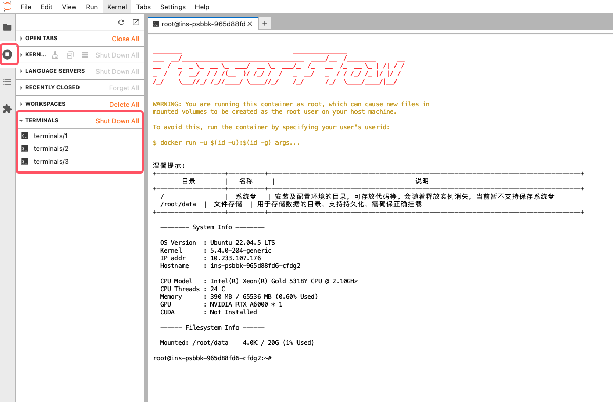
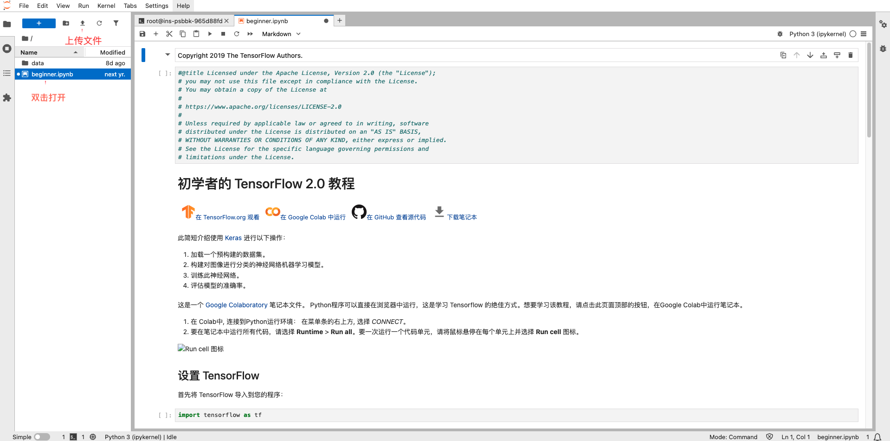

# JupyterLab

**JupyterLab** is the next-generation **Jupyter** interactive development environment based on the web. It allows you to manage files, execute shell commands, and run Python code directly in the browser. JupyterLab also supports plugin extensions and includes all features of **Jupyter Notebook**.

This guide explains how to use JupyterLab on **d.run**.

## Basic JupyterLab Operations

1. When creating a container instance, check the **JupyterLab** access tool option (enabled by default).

    <!--  -->

2. After the container starts, click the quick access link in the container instance list to open JupyterLab.

    <!--  -->

3. On the JupyterLab start page, the left section is the file browser for viewing the directory structure within the instance. The right section is the workspace.

    <!--  -->

## Using JupyterLab

1. On the start page, open a terminal.

    <!--  -->

2. Once the terminal opens, you can execute commands directly.

    <!--  -->

To exit the terminal properly, run `logout` or press `Ctrl+D`.

> ⚠️ If you close the terminal window directly, the terminal and any running tasks will continue running in the background.  
> You can check active terminals by clicking the “Running Terminals and Kernels” button in the left sidebar.

## Running Code

1. First, create a container instance with **TensorFlow 2**.

2. Download the `beginner.ipynb` notebook file and upload it to the server via JupyterLab. Double-click to open the notebook—you will see the code content in the right-side workspace.

    

3. From the menu, select **Run → Run All Cells** to execute all the code in the notebook.

    

4. You will see the program output displayed below each cell in the workspace.

    
