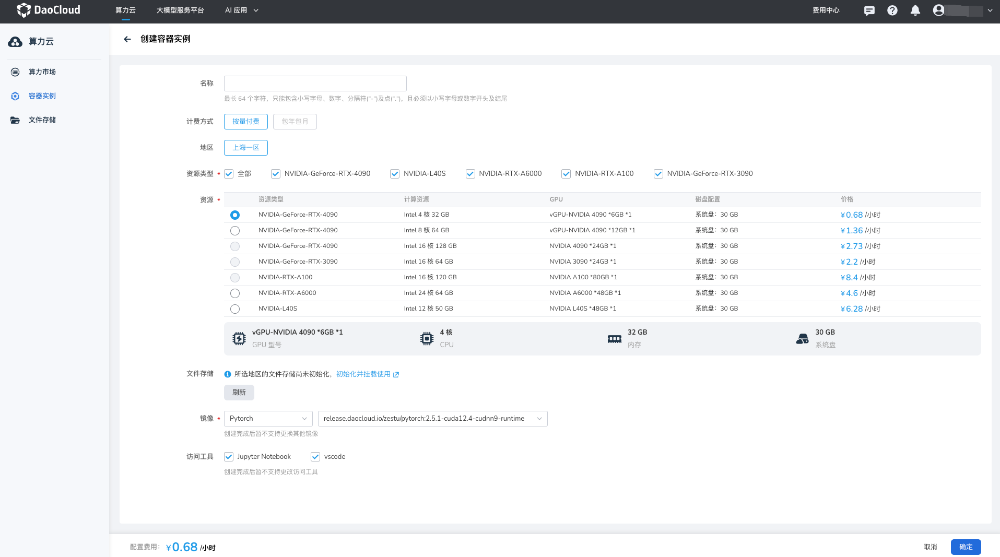

---
hide:
  - toc
---

# 创建容器实例

容器实例常被用来做算法开发和推理。创建时可选多种GPU类型，灵活匹配算力需求。
实例自动关联文件存储，便于数据管理。支持使用系统内置镜像快速部署环境，并通过
Jupyter Notebook、VSCode、SSH 等多种工具实现便捷开发与访问，助力高效完成算法研究与推理任务。

## 前提条件

- 登录 d.run 账号
- 账户余额大于等于所选资源类型的单价

## 操作步骤

1. 登录 d.run 平台，默认进入 **算力市场** ，可选择所需 GPU 资源类型 **立即购买** ；
   或切换到 **容器实例** ，点击 **创建** 按钮进行创建。

1. 参考下列要求填写基本信息，并点击 **确定**

    

    | 名称 | 说明 |
    |-----|------|
    | 实例名称 | 最长 64 个字符，只能包含小写字母、数字、分隔符("-")及点(".")，且必须以小写字母或数字开头及结尾，非必填。 |
    | 计费方式 | - 按量付费：费用=时长*单价。时长=关机时间-开机时间，精确到秒，开机或等待过程中不计费。按小时计费，不足一小时将按实际使用时长扣费，精确到秒。   - 包年包月：按月/年预留资源，租用时一次性付清。若选择该计费模式，需配置购买时长、是否自动续费及续费时长等参数。|
    | 地区 | 建议选择与自己相近的地区创建实例和初始化文件存储，文件上传和下载速度更快。 |
    | 资源类型 | GPU 资源型号。 |
    | 资源 | 支持整卡 GPU 和 vGPU 资源，根据需求选择。 |
    | 系统盘 | 免费容量为 30 GB，不支持扩容。系统盘可保存至我的镜像。|
    | 数据盘 | - 免费容量为 50 GB，支持付费扩容，实例关机状态下不停止计费。   - 可扩容容量默认最大为 200 GB，更大配额请联系 400-002-6898。扩容后无法进行缩容。   - 与容器实例的生命周期强绑定，实例创建时自动挂载，实例删除时自动删除。   - 不支持实例间的数据共享。|
    | 文件存储 | 初始化文件存储后，将自动挂载到实例中，默认挂载路径为：/root/data。 |
    | 镜像 | - 基础镜像：支持 Pytorch、TensorFlow、Paddle、vLLM 和 SGLang 等。   - 应用镜像：支持 DeepSeek、ComfyUI 等热门 AI 应用镜像。   - 我的镜像：支持使用我的镜像中保存的镜像创建容器实例。   - 镜像地址：公有或用户私有镜像地址，私有镜像需输入用户名和密码。|
    | 访问工具 | 可选择通过 Jupyter Notebook 和 vscode 访问该容器实例。若取消勾选，则不会安装相关组件，创建完成后暂不支持更改访问工具。 |
    | 定时关机 | 支持指定时间关机。 |
  
1. 点击 **确定** ，完成实例创建。

!!! note

    - 容器处于启动中、排队中、已关机、删除中等状态下时不产生任何费用，仅处于运行中和关机中时正常计费。
    - 按量计费的资源单价为运行该实例每小时产生的费用，实际使用不满一小时，则按实际使用时长计费，精确到秒。
