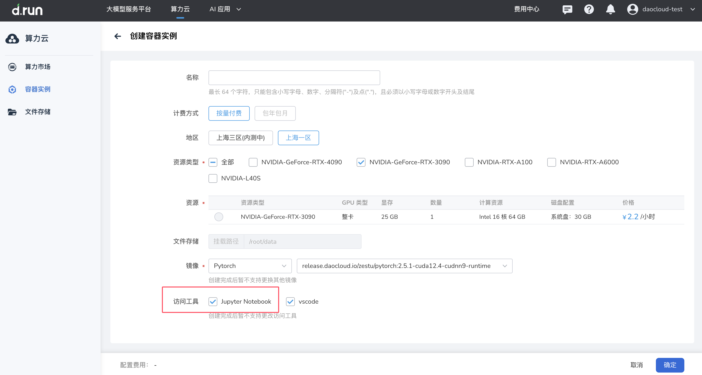
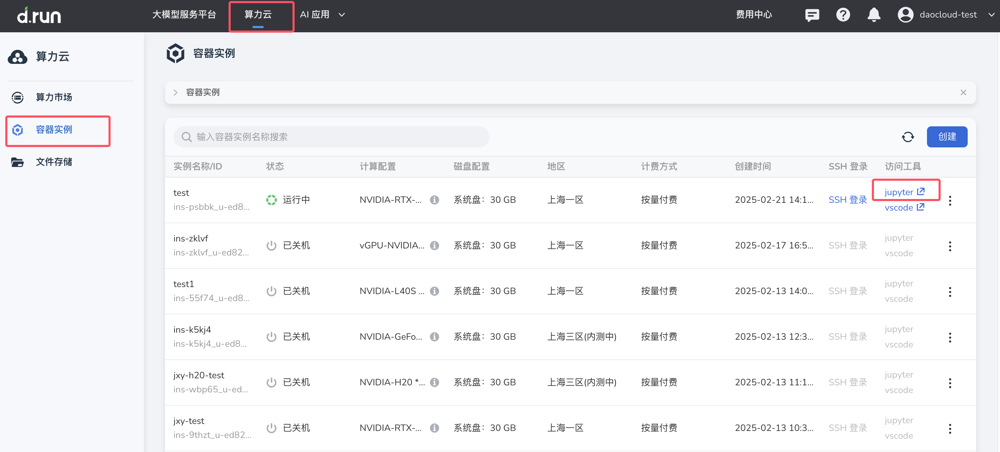
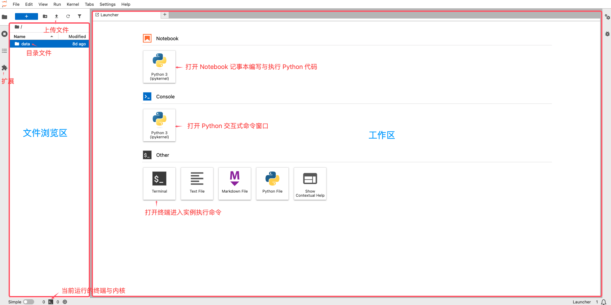
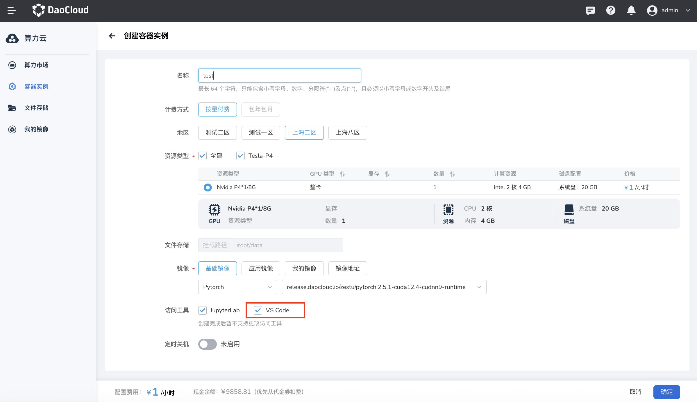
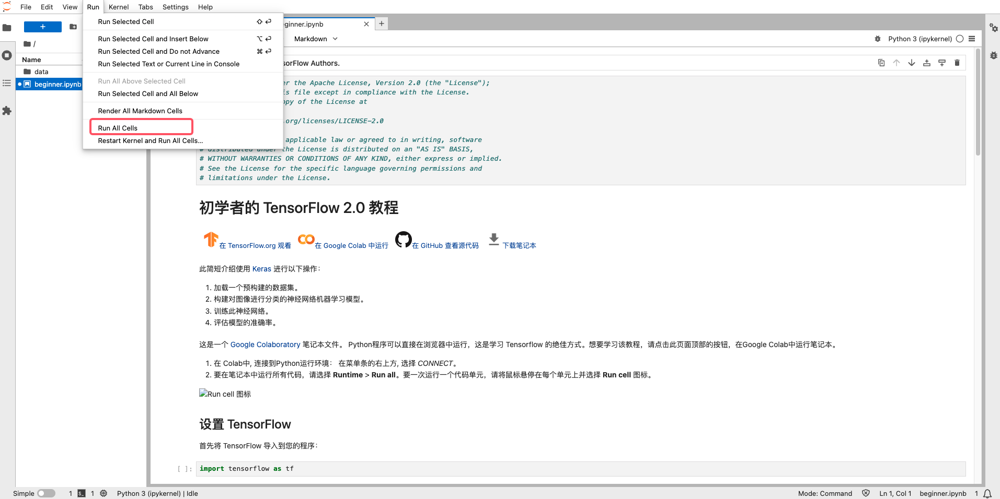

# JupyterLab 

**JupyterLab** 是基于 Web 的新一代 **Jupyter** 交互式开发环境，可以通过 Web 管理文件并执行 Shell 命令和Python 代码，还支持插件扩展。
**JupyterLab** 包含了**Jupyter Notebook** 的全部功能。

下文介绍如何在 d.run 上使用 JupyterLab。

## JupyterLab 基本操作

1. 创建容器实例时勾选访问工具 JupyterLab（默认勾选）

    

2. 容器启动后，在容器实例列表中点击快捷访问链接打开 JupyterLab

    

3. 进入启动页，所测为文件浏览区，可以查看实例内的目录文件，右侧为工作区

    

## 使用 JupyterLab

1. 在启动页中打开终端

    

2. 打开终端后可以直接执行命令

    

使用完成后再终端内执行 logout 或 Ctrl+D 正常退出终端。

如果直接关闭了终端窗口，这个终端仍然会在后台继续运行，包括正在执行的命令任务。
您可以在左侧菜单栏点击正在运行终端和内核按钮，查看运行中的终端。

## 运行代码

1. 首先创建一个为 TensorFlow 2 的实例。

2. 下载 beginner.ipynb 记事本文件并通过 JupyterLab 上传到服务器中。双击打开记事本，在右方工作区中可以看到笔记本中的代码内容。

    

3. 在菜单中选择 运行-运行所有单元格，即可运行所有代码。

    

4. 在工作区每个单元格下方可以看到程序的输出。

    
