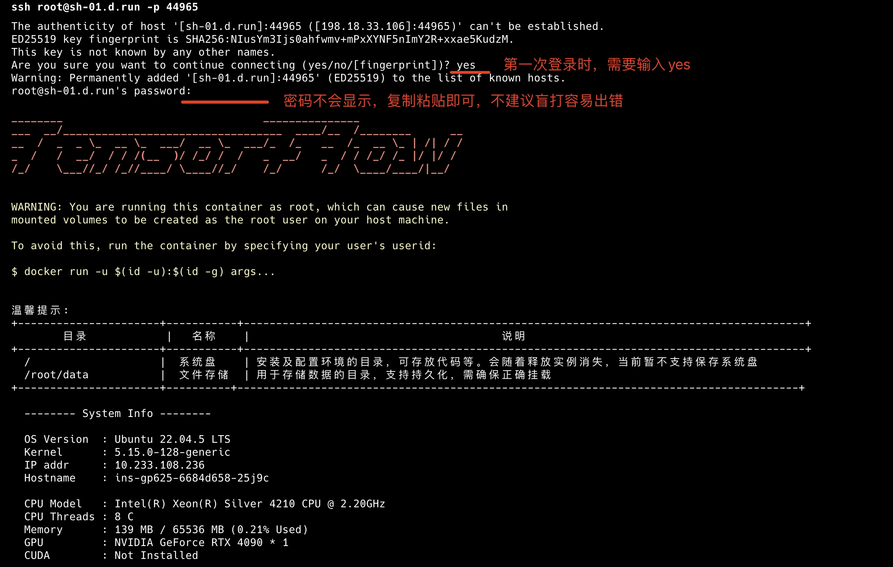

# 访问管理

访问管理 d.run 平台给用户暴露服务到公网访问的一个功能，允许将任何端口暴露到公网进行访问（不包含已经预留服务的端口：22/5555/6666/10001/10002）。

本文以 ngnix 为例，介绍如何使用容器实例的访问管理能力开放端口。开放端口生成的外部访问地址可供外部人员访问。

## 前提条件

- 登录 d.run 账号
- 已通过算力云[创建容器实例](https://docs.d.run/zestu/instance)，且容器实例状态为 **运行中**

## 操作步骤

1. 登录 d.run 账号，在顶部导航栏点击 __算力云__ ，然后点击左侧导航栏的 __容器实例__ ，在容器列表中选择您要操作的容器实例。

    

1. 在容器实例列表页面，点击 __SSH 登录__ ，通过 SSH 命令登录容器实例。

    
    
    

1. 安装并启动 nginx 服务。

    ```bash
    apt update
    apt install -y nginx && nginx && ps -ef|grep master
    apt install lsof # 安装lsof
    ```

1. nginx 默认端口是 80，检查一下 nginx 是否正常启动。

    ```bash
    lsof -i:80
    ```
    
    返回如下信息，表明端口被 nginx 正常占用。
    
    ```bash
    COMMAND  PID USER   FD   TYPE    DEVICE SIZE/OFF NODE NAME
    nginx   2693 root    6u  IPv4 723250562      0t0  TCP *:80 (LISTEN)
    nginx   2693 root    7u  IPv6 723250563      0t0  TCP *:80 (LISTEN)
    ```

1. 将 nginx 的端口添加到访问管理，并等待外部端口的分配（约 1 分钟）。

    
    
    

1. 点击生成的外部访问链接，即可访问 nginx 服务。

    
