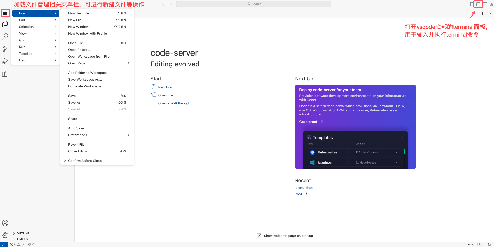
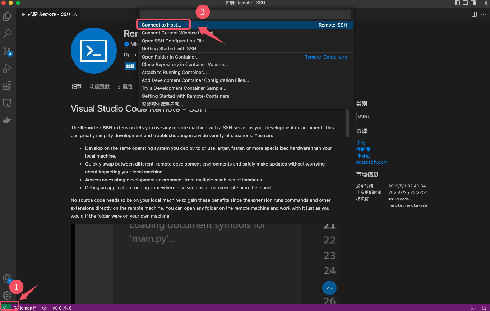

VSCode 

**VSCode**是微软开发的一款跨平台代码编辑器，免费、开源并且支持扩展插件。平台既支持云端快捷使用 VSCode，也支持在本地使用 Remote 插件连接到远程服务器上进行开发。

## 平台 VSCode 使用

1. 创建容器实例时勾选访问工具 VSCode （默认勾选）

2. 容器启动后，在容器实例列表中点击快捷访问链接打开  VSCode

3. 进入VSCode UI 页面，点击右上角**Toggle Panel**，可打开 VSCode 底部的 Terminal 面板，用于输入并执行 Terminal 命令。左侧相关菜单栏，可进行**新建文件**等操作。

4. 在左侧导航栏中，点击**扩展**，进入扩展列表，用户可根据实际需要安装相应扩展组件。在扩展列表中，选择待安装的组件（以 Python 扩展为例），打开其介绍页面，点击**Install**，等待组件安装完成即可。

## 本地 VSCode 使用

1. 本地VSCode配置 Remote-SSH
!!! note

    如果您本地VSCode开发工具已安装Remote-SSH，可跳过此步骤，直接参考 [步骤2]

打开您本地的VSCode开发插件菜单，在扩展程序中搜素`Remote-SSH`并安装

2. SSH连接并登录您平台上租用的实例

按照 ① ② ③ 顺序进行点击，完成添加SSH主机

3. 复制并获取您实例的登录信息

4. 图示以`ssh root@sh-01.d.run -p 30817`为例。回车键继续操作。

远程主机信息会保存在本地配置文件中，选择第 1 个配置文件完成添加。

5. 连接远程主机

添加完成后在 远程资源管理器 中显示刚添加的远程主机。点击在新窗口中打开连接的按钮。

6. 复制并获取实例的登录密码，参考 [步骤3]，将复制的登陆密码粘贴，输入 Enter。

7. 成功连接后点击 资源管理器 标签会显示已连接到远程。同时左下角提示已连接的远程主机名称。

